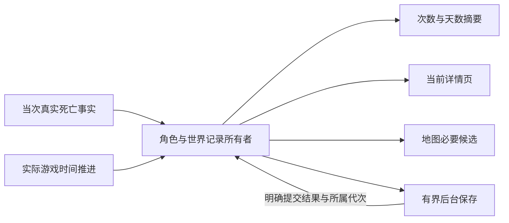

# 死亡信息、死亡详情、世界天数与死亡点常驻行为合同

**四项实现及直接死因、紧凑详情界面修订已获所有者正式接受。** 接受候选为 `5b42a1c4d1fe3b8b335a31716001d81e0aea1ca3`，见[实现接受与收口授权](https://github.com/Kuroneko2020/JueMingR/issues/81#issuecomment-5684334418)。首轮时间累计、身份、地图数量四档和同窗全文目标的历史依据见[需求接受与实施授权](https://github.com/Kuroneko2020/JueMingR/issues/79#issuecomment-5678391471)。本文保留 Legacy 静态提取与原版证据，不把后续实现接受倒写为调查阶段的运行验证。上位边界见 [Legacy 平替规则](../规范/Legacy平替与行为契约规则.md)、[总体架构](../设计/总体架构与状态所有权.md)和[配置设计](../设计/配置持久化与用户数据布局.md)。

构建、安装来源与实际合并收口查 [实施 #81](https://github.com/Kuroneko2020/JueMingR/issues/81) / [PR #82](https://github.com/Kuroneko2020/JueMingR/pull/82)，调查来源查 [#79](https://github.com/Kuroneko2020/JueMingR/issues/79)。以下调查段落保持原V0身份；当前实现和接受边界见第12节。

## 1. 来源与结论边界

- R 静态基线：`9461d36229772552e46aeaded2f9441f77f1646a`。当前完整 `direction-equipment-` profile 与早期群系样板分别核对；主线 squash 身份不代替已安装候选来源。
- Legacy：仓库 `Kuroneko2020/JueMingZ`，冻结跟踪源码 `6ac6356c0c564f43284590c168855e96c50e13f7`。本文的 `Lxx` 证据以该源码为准，不以旧说明的 `Implemented` 或过去测试通过证明玩家可用。
- 原版：本地合法编译引用 `external/TerrariaRefs/Terraria.exe`，程序集/FileVersion `1.4.5.8`，SHA-256 `960A03BFF6050CF7BE16DFC1A7B19E10FC2C4F8F835A6A3B135A50DD9E6BA2F3`，与[锁定 baseline](../../eng/TerrariaReferences.baseline.json)现场一致。使用已有 `ilspycmd 10.1.0.8386` 定向提取类型，没有启动或执行游戏逻辑；`Nxx` 是这次反编译 C# 的方法与行段，不冒称原始源码、IL offset 或运行验证。
- 本轮提取位于被忽略的 `.local/death-history-world-time/`。`references` 中历史 `.6/.7` 不用于证明当前 `.8`。未跟踪旧说明、既有整理与新提取的身份不能由 Legacy 源码 SHA 背书；本轮没有读取真实用户配置、死亡历史、Notes 或存档。
- **所有者已决定的范围**：四项成组实现、记录与展示分开、不静默删历史、未知不假零、不放宽游戏操作安全门；具体首轮目标见第 10 节。普通内部设计由实施任务负责，不要求再次确认相同目标。旧文档声称、代码实际行为、测试意图、静态已证问题、推断和新版合同分别标明。
- 本文调查证据层级为 **V0 静态提取**。调查与需求收口未运行产品测试、Legacy、探针、游戏、多人、图形或性能测量。静态路径可证明发生某种输入时的代码后果，不能证明用户已经遇到事故、实际卡顿、毫秒收益或 FPS 改善；后续实现证据单独记录。

## 2. 四项能力与共同事实

| 用户能力 | Legacy 实际入口、默认与用途 | 共同事实及边界 |
| --- | --- | --- |
| 死亡信息 | F5 地图页固定信息行，注册默认启用；显示当前角色×世界死亡次数，无独立开关/动作/热键 | 正常读 `death-summary.json`；不是原版角色 PVP/PVE 计数，更不是全服死亡总数 |
| 死亡详情 | 死亡信息行的“详情”模态子入口，无独立 Feature 或保存开关 | 从同 pair 的 `deaths.jsonl` 查全部可读历史；页面只展示现实时间和原因，底层坐标另供地图 |
| 世界天数 | 地图页固定信息行，注册默认启用；无开关、配置窗或动作热键 | 当前角色在此世界被观察到的游戏时钟累计，内部有小数，页面只显示整数；不是世界创建年龄或现实在线时长 |
| 死亡点常驻 | 地图页普通开关，默认关闭；开启后只在全屏地图画历史死亡点 | 与死亡详情使用同一文件，但 Legacy 实际为独立读取/缓存；关闭展示仍捕获死亡，“最近 256”不删除更早文件记录 |

注册说明的行序与真实页面行序并不完全相同；入口以实际 `DrawMapEnhancementPage` 为准。三项注册多人标签均只表示本地辅助、等待多人验证，不能当作联机通过。参见 L01–L03。

首轮按**角色×世界记录职责**组织：死亡次数、详情、地图是同一死亡事实的三个消费者；计时另有自己的观察算法和累计状态。它们可以共享身份与机械文件机制，不机械建四套 Feature/服务/记录，也不合并为一个承担 UI、地图投影和全部存储的巨型类。

## 3. 死亡信息与详情

### 3.1 从真实死亡到记录

当前 Legacy 采用 `Player.KillMe` Hook 完成后的采集，非 `dead` 轮询重建历史。实际链为：死亡 Hook → 去重/本地角色判断 → `PlayerWorldDeathRecorder.TryRecordCurrentDeathFromHook` → 解析 pair → `PlayerWorldDeathEventBuilder` 固化事件 → 同步追加明细 → 全量重数明细 → 读/改/写摘要 → F5/地图分别重读。显示开关不参与采集准入；生产入口传入的 `persistentDeathMarkersEnabled=true` 只影响诊断文字，不能当作真实开关状态。（L04–L08）

当前原版 `.8` 的 `Player.KillMe` 在 creative god mode 或已经 `dead` 时直接返回；有效路径增加原版 PVP/PVE 计数、设置最近死亡点及时间、设 `dead=true`，生成原版死亡文本，再广播并供墓碑消费。因此“调用了 KillMe”与“发生新死亡”必须分开，持续倒计时不是新死亡。死亡取消、重复回调、刚进世界已死、复活再死及会话切换的具体旧去重边界见本节补充证据；R 首轮合同必须以一次真实完成的死亡对应一个事件身份。（N02）

身份解析失败时 Legacy 当场返回，无未归属事件暂存；事件构建/追加失败也没有等待保存的内存历史。后续界面只能见到实际可读磁盘部分，无法保证失败的这次死亡仍可查。单次原版正常返回也不证明其它补丁没有取消、重入或改变状态，本轮未验证外部补丁组合。

### 3.2 次数与错误状态

正常次数取摘要 `DeathCount`。摘要异常时缓存会尝试用明细回退，因此不是始终直接 `records.Count`。原版自己的 `numberOfDeathsPVP/PVE` 是另一统计，不用于本 pair 的次数。（L06、L09）

| 状态 | Legacy 实际表现与问题 | R 首轮合同 |
| --- | --- | --- |
| 可靠缺文件/空历史 | 0 次、空详情 | 保留可靠 0；不创建空文档只为补默认 |
| 身份未知 | 次数 `--`，不可当作另一角色/世界 | 显示“暂时无法读取此角色在这个世界的记录”，不显示旧 pair |
| 正在加载 | 旧链主要同步，没有可信异步加载态 | 明确“正在读取记录…”；新死亡仍由本会话 owner 接收 |
| 读取失败 | UI 主要只看 `IdentityResolved`，没有完整消费 `ReadFailed/Succeeded`；可能显示 0、部分历史或“暂无” | 历史未知与本次已知增量分开；不得显示总计 0 或完整成功 |
| 写失败 | 摘要与明细可能只有一个成功，失败主要留在诊断 | 已知事件继续展示，标明尚未保存；提交未确认单独停写，不盲重试 |

此处纠正的是可定位旧路径，不能把原有整理中的理想失败态倒写为旧实现事实。（L03、L06、L09）

### 3.3 记录字段与显示字段

`PlayerWorldDeathEvent` schema 1 实际包含以下 **19 个字段**（L05）：

| 字段 | 来源及用途 |
| --- | --- |
| `SchemaVersion / EventId / IdentityPairId` | 格式、事件标识及归属；不是玩家可见序号 |
| `RealTimeUtc / RealTimeLocalText` | 捕获时的现实 UTC 与本地显示文字；与世界游戏时间不同 |
| `PlayerTileX / PlayerTileY / PlayerWorldX / PlayerWorldY` | 当次玩家中心 Tile 与像素坐标，供地图；详情未提供坐标列 |
| `DeathText` | 当次 Hook 内重新调用原版原因生成后得到的文本，并非复用原版刚生成的同一文句 |
| `Damage / HitDirection / Pvp` | KillMe 参数；不是从聊天解析 |
| `SourceKind / SourceNpcType / SourceProjectileType / SourcePlayerName / SourceOtherIndex / SourceCustomReason` | 当次结构化原因字段及即时槽读取的有限快照；缺失使用 unknown/-1/空值，不含完整 NPC/弹幕实例身份 |

摘要另存 schema、pair、次数、最后事件/时间、写入及历史/摘要读取错误状态，共 14 字段。它与明细不是一个原子提交单元。原版原因结构还有 item type/prefix，Legacy 事件未保存；不能事后承诺恢复这些信息。

详情只提供“死亡时间 / 死亡原因”两列及合计/页码/翻页，未提供序号、坐标、搜索、删除、导出或统计面板。地图可从同一事件使用 Tile，不意味着详情已向玩家展示坐标。（L03、L05、L09）

### 3.4 原因真实性与本地化

Legacy 在 postfix 先读 `_sourceNPCIndex`、`_sourceProjectileLocalIndex`、`_sourceProjectileType`、`_sourcePlayerIndex`、`_sourceOtherIndex`、`_sourceCustomReason`，再反射调用 `GetDeathText(playerName)` 并转字符串。NPC 类型和玩家名从当前槽取得；弹幕类型优先采用原因结构中大于 0 的 `_sourceProjectileType`，缺失时才回退读取当前弹幕槽。读槽时未核验 active/实例代次。捕获后保存的是文本和值，不在以后打开详情时按新槽重新构造原因。（L07）

当前 `.8` 已证：`Player.KillMe` 原来生成的 `NetworkText` 会送广播和墓碑；Legacy 第二次调用 `GetDeathText` 时，自定义原因直接返回 literal，其余原因进入 `Lang.CreateDeathMessage`。后者包含随机类别及 `Main.rand.Next`，**相关分支会再消费共享随机流，且不保证文句相同**；不能把该副作用写成所有原因无条件发生。`NetworkText.ToString` 按当前语言格式化，异常会把该对象变为空 literal。旧详情对空原因回退“死亡原因未记录”。这不是可一概视为无副作用的普通 getter。（N02–N05）

因此 R 首轮合同优先捕获**原版当次已经生成的结果与当时可确认的原因值**，不得重新触发随机生成、广播、墓碑或解析聊天重建全服历史。确切可复用的只读捕获位置仍需后续窄设计核验；若安全取得不到原句，保留当次可信来源事实或明确原因缺失，不能延后从已复用槽补造名字。首轮不要求给历史记录重新翻译，保留当次语言文本；显示界面自身文案仍随当前资源更新。

### 3.5 去重与详情的完整旧行为

Hook prefix 保存 `IsLocalPlayer/WasDead`，postfix 只接受“本地、进入时未死、返回时已死”。本地识别先引用相等，再回退 `whoAmI==Main.myPlayer`。这能排除正常取消及已经死亡时的再次调用，复活后新的 false→true 会再记；不是 EventId 幂等存储，也没有会话 generation。（L04）

- 没有新 KillMe 的“入世时已经死亡”不补记录；断线重连不能重建错过的死亡。
- Recorder 不查重复 EventId，同事件重复提交会重复追加。若嵌套调用均在 prefix 看到未死、postfix 看到已死，也可重复记录；仅为条件风险，未证明原版自然产生此嵌套。
- 只有 postfix、没有 finalizer；原版中途异常、其它补丁取消/重入、死亡期间对象改变不能由正常返回场景保证覆盖。

| 详情行为 | 冻结 Legacy 的实际结果 |
| --- | --- |
| 按钮资格 | “详情”未设置不可用条件，继承 `Enabled=true`；无记录、身份未知、读失败均可打开 |
| 时间来源/格式 | postfix 的 UTC，持久本地文本 `yyyy-MM-dd HH:mm:ss zzz`；优先原样显示本地文本，缺它时 UTC 转查看时本地时间且无时区，再失败用原 UTC 或“时间未记录” |
| 排序 | UTC 从早到晚；同 UTC 按文件顺序；不可解析的时间排在有效时间后，仍按文件顺序 |
| 页大小 | 实际 UI 每页 6 条；缓存参数另夹在 1–20，不能说 UI 可调 20 条 |
| 首次打开 | pageIndex=0，即最早页 |
| 边界 | 超界夹到末页；空历史 `0 / 0`，前后按钮禁用 |
| 追加 | 保留当前页码，不跳最新；末页未满增加行，满了增加下一页；系统 UTC 回拨可能插入前面、移动原页内容 |
| 关闭/切页 | 显式关详情只清 open，再点开重置最早页；暂藏 F5/切其它页未清详情 open/页码，返回地图页可能恢复 |
| 换世界 | 文件缓存按 pair 失效，但 popup open/页码没有主动按 pair 清空，只按新历史夹页；未知身份时页码归 0 |
| 长文本 | 时间/原因均单行省略，无全文 tooltip 或展开入口；原文可能保存在文件中但玩家不能完整查看 |

R 首轮保留两列、时间升序、6 条和显式首次最早页；同一详情弹窗采用“列表→所选记录全文→返回列表”两种内容状态。原因列可点击，全文显示时间与原文，按有效宽度换行，超长时只读滚动；返回保留原列表页，事件身份与选中项绑定，不按会移动的行号指向另一条记录。历史与页面游标分开，稳定内容不重排。真实会话切换强制关旧详情、取消旧请求，重新打开读新 pair；同会话临时隐藏/切页可保留页码，但不隐形占输入。新死亡更新计数并仅在影响当前页时准备页面，不强制跳末页，不用每帧排序全部历史。（旧事实 L02、L03、L09；新版决定见第 10 节）

全文 Esc 返回列表，列表 Esc 关闭详情，显式关闭再开从最早页开始；F5/地图强制退出沿现有壳层清捕获和尾缘。详情与数量配置互斥，复用现有模态和安全文本，不叠第二弹窗或新 Tooltip 系统。小视口滚动当前页内容区域，标题与底部操作保持可达，逻辑页仍最多六条，不缩小字体硬塞。具体尺寸、真实资源/输入和实际视觉由实施验证，不新增编辑、搜索、删除、导出或统计。

## 4. 世界天数

### 4.1 “天”的单位

Legacy schema 1 保存 `double TotalGameTicks`；白天长度 54000、夜晚 32400，全天 86400。周期位置为白天 `time`，夜晚 `54000 + time`；`WholeDayCount=floor(total/86400)`，从 **0 天**起。内部累计精度不等于页面精度，不读取 `PlayerFileData.GetPlayTime`，不按现实秒数或固定外层帧数除一天。（L10–L12）

第一次有可靠 pair 时加载旧累计，拿当前世界钟种下首样本；缺文件从零起。重进或重启不会用落盘的最后时间补算离线历史。记录里的 UTC 只是采样/保存元数据，不能用文件时间、当前昼夜或最后死亡点推算之前玩过多少天。

### 4.2 实际采样、暂停和离开

旧 Runtime 在输入焦点门之前调用 playtime sampling。`IsInWorld` 只要求非菜单、player 存在/active，没有 dead 门；服务还要求可靠 pair 和可读时钟，没有独立暂停/失焦条件。死亡等待期间只要时钟推进便可继续累计；暂停、失焦是否计入取决于游戏实际推进，不由外层 Hook 调用次数决定。（L11、L13）

采样间隔为 60 个 Runtime 更新，正常保存到期为 1800 个 Runtime 更新；不是严格的 1 秒/30 秒保证。身份未知、时钟不可读、菜单或退出会尝试 flush 并打断采样；迟到身份以前没有累计暂存。复活不自行换 pair，真实换角色/世界才切数据。

### 4.3 差值算法与可达误计

旧 `TryCalculateDelta` 按以下步骤计算（L11）：

1. RuntimeTick 必须递增，间隔大于 600 放弃整段。
2. 周期位置增长就直接相减；负差只有“夜→昼”补 86400，其它回拨放弃。
3. 最大可接受差值为 `min(43200, max(7200, tickGap × max(1,前后dayRate) × 3))`。
4. 接受正差才加总；无推进提前返回，跳过差值会重种样本并记录原因。

| 输入变化 | 静态推演出的旧结果 |
| --- | --- |
| 同一白天 1000→7000，间隔 60、rate=1 | 6000 小于下限 7200，会作为累计；不能区别调时/网络校正 |
| 夜晚末端→白天早段 | 可按跨日接受；仅见这两个钟值不能证明自然黎明 |
| 两次取样间完整绕一圈、回到同一周期位置 | 差值为 0，完整一圈丢失 |
| 回拨后再次正常走过旧区间 | 回拨被跳过，随后推进可再次累计；不是唯一世界时间轴 |
| 样本中间加速，首尾倍率低 | 阈值只看首尾，可能错丢实际推进 |
| 外层不完整更新、世界钟没变 | 不加累计，但仍有采样/克隆/诊断工作 |
| 已有未保存累计后冻结时间 | `noClockProgress` 直接返回，不能按保存到期把此前 dirty 落盘 |

以上是按真实公式计算的静态反例，未运行测试，也没有断言用户发生过这些事件。

### 4.4 当前原版与推荐累计口径

当前 `.8` `Main.UpdateTimeRate` 把日/月晷 fast-forward 设为 60；旅行目标倍率叠加全员睡眠的 5 倍，FreezeTime 为 0。`UpdateTime` 先更新 rate，再 `time += dayRate`；正常昼夜交界在超过 54000/32400 后切换并重置 time，交界还可能结束 fast-forward 并再改 rate。`SkipToTime` 可直接赋时刻；客户端消息 7/18 直接覆盖 time/dayTime。外层 `DoUpdate` 在菜单、暂停、焦点/游戏更新条件不满足时可先返回，`UpdateWorld_Time` 还会局部捕获异常。（N01、N06）

**已接受的首轮口径**：累计本角色在此世界被实际观察到的游戏时间推进，计入睡觉、日/月晷和旅行倍率；冻结/实际暂停不增加，直接设时、回拨与网络校正不算游玩增量。不补断线、离线或未加载历史；普通客机只能表述本客户端的观察累计，不保证服务器完整历史。

取得本次**实际执行的推进贡献**是必要的窄 Host 缺口。不能直接读 `UpdateTime` 入口旧 rate 或方法尾 rate 代替，因为该方法内会更新/重置它；也不能按 Update 次数、现实秒数或稀疏钟差假装精确。后续实现需核验推进点、成功/异常/跳过与恰一次交付，无法安全做到时应把准确性限制交回裁决。继续旧差值阈值的备选方案较简单，但必须接受小校正误计及部分漏计；不推荐同时声称能精确排除跳时。

### 4.5 旧保存与显示问题

旧 service 在 Tick 的 `SyncRoot` 内同步加载/写 JSON，不是后台；读失败或 pair 不符创建零值对象，`EnsureFileShape` 改写 schema/pair，后续正增量可能覆盖无法读取的原件。没有未知字段/未来版本保护。当前 pair 写失败虽暂存 dirty，但菜单/身份失败仍清内存，换 pair 也会替换未成功保存对象；没有可靠的跨会话未保存所有权。（L11、L14）

写失败不推进下次保存时间，之后有正差或跳时的采样可重复同步写，无明确退避/次数上界。正常退出只 flush，不补最后一次时钟样本；可能漏不足一次采样间隔内的时间。强退丢失窗口受最后成功提交、冻结与持续失败影响，不能承诺“最多 30 秒”。

页面只对身份未知显示 `--`；读失败仍可显示 `0 天`，tooltip 说“读取失败，暂按 0 天显示”。service 内存快照还可能隐藏读/写失败。此前[Legacy 地图整理](Legacy地图与足迹.md)的“身份/读取失败均 --”不是旧代码事实，已按本轮证据纠正。（L03、L12）

R 应分别维护已确认历史、本会话新增、已提交累计与显示状态；保存节奏独立于整数天显示是否变化。无新增时不保存；有 dirty 后即使冻结也能按合并期限提交。正常退出有总等待上限，超时/强退的未保存边界如实说明。

## 5. 死亡点常驻

### 5.1 入口、样式与持久含义

实际地图页第 4 行（零基 3），开关 `MapPersistentDeathMarkersEnabled` 默认 false。统一快捷键目录允许绑定，默认未绑定；没有独立颜色/大小配置。按钮赋同值也调用 `ConfigService.SaveAll`，并忽略保存结果；热键切换同一布尔值再走公共保存。它没有装备资格或 dead 门。（L01、L03、L17）

只在 `mapFullscreen` 且原版地图与 `TextureAssets.MapDeath` 可用时画；小地图、叠加地图虽然也调用原版 MapIcons，旧层会早退。图标直接借用当前原版 MapDeath，单帧中心对齐、白色乘 context opacity，无独立 hover 放大。资源属于原版，不能由本功能 Dispose。

“常驻”指从本 pair 的已落盘历史重新读取，不依赖原版最近死亡点字段；成功记录可跨复活、重新入世和重启保留。身份变了、记录没成功落盘或不可读时不保证仍显示。关闭只停展示，采集及必要保存继续；关闭未释放旧候选缓存。（L15、L16）

### 5.2 最近 256 的执行顺序

`ReadCurrentMarkers(256)` **从文件开头扫描**，逐行反序列化，排除不匹配 pair 和不可构成坐标的事件，以 `RemoveAt(0)+Add` 保留文件顺序最后 256 个有效候选，然后每帧复制候选、投影、裁切、绘制。没有按 UTC 排序，也不是“视口内最新 256 个”；旧但在视口内的点不会补占被屏外新点占用的名额。（L15）

更早的记录仍在文件，可在详情查看。相同坐标和同 EventId 不去重；旧到新绘制时后面的命中覆盖前面的 hover 文字。图层里的 `drawn>=256` 是第二道上限，不能抵消前面全史读取成本。**存储保留、候选筛选与最终绘制数量是三个不同合同。** 上述 256 是旧固定值；R 的四档选择是本轮新决定，不能以任何展示数量截断存储历史。

### 5.3 R 已确认的四档数量与偏好

R 死亡点常驻默认关闭，仅全屏地图；接公共开关快捷键，默认未绑定。标准“配置”入口采用紧凑标题“死亡点常驻”、一项“地图显示数量”和 128/256/512/1024 四个标准选中态选项，首次默认 256。点击本次生效、沿普通偏好后台保存，关闭只退出；同值不产生修订/保存，不套用调色草稿撤销流程，不改开关、绑定或详情页。

这里的 K 是当前角色在当前世界按稳定事件发生/接纳顺序最近 K 次具有有效地图位置的死亡，然后再按视口裁切。不是 UTC 最新、视口内最新、距玩家最近或保存上限；UTC 回拨不把新事件排出近期范围，重复位置仍是不同死亡，屏外近期点仍占名额，不用更早屏内点补位。详情时间升序与地图发生顺序分别维护。

调低立即缩小有效候选需求，不删历史、不改次数，调高按需取回更早候选；历史不足就画实际部分。连续切档只保留最终需求，结果绑定身份、历史修订和需求；旧 1024 结果不能覆盖新 128，旧世界不能回流。关图/关显示不为预览数量准备地图内容；保存已提交偏好和死亡记录继续。没有无限、自定义整数、硬件自动分档或视口优先模式，不作未经测量的流畅承诺。

### 5.4 坐标、层级与原版共存

当次事件优先取 `Player.Center`，回退 `position + size/2`；存像素坐标及 `floor(pixel/16)` 的 Tile。地图优先像素/16，缺失时取 Tile+0.5；只检非负，未完整检查有限数值和世界尺寸，越界/Infinity 不受可靠保护。（L07、L15）

当前 `.8` 原生 context 投影为 `(tile-mapPosition)*mapScale+mapOffset`；图标尺寸另乘 `drawScale`。全屏地图锚点随 `mapFullscreenScale`，图标尺寸实际随 `UIScale`，两者不能混写。旧层先算 `GetUnclampedDrawRegion` 与屏幕相交，再调用 `Draw` 重做投影/命中；没有屏边箭头或传送。全屏 MapIcons 的 clippingRect 为 null，旧层补的是屏幕裁切。（N07、N08）

原版 `showLastDeath` 标记先画，之后 MapIcons 按添加次序画。Legacy 加层顺序为足迹→死亡点→自定义地图标记；没有改原版 `lastDeathPostion/lastDeathTime/showLastDeath`。同一次最近死亡可能出现两图；原版另加 Y 偏移 `-2 + 0.4*mapScale`，所以不能说它们总完全重合。旧层后写 hover 可能覆盖原版“距死亡多久”的文字。（L16、N02、N08）

原版这个绘制分支没有按经过时间自动过期的条件，不能凭印象声称“几分钟后消失”。原版最近点的完整跨世界/角色重建/重启寿命未在本轮穷尽；Legacy 历史持久化与它分开。

已确认的共存规则：不修改原版字段或寿命；能可靠对应**同一次死亡**时让原版承担当前最近点，R 暂不重复画该事件，原版不再呈现时由历史层承担。不能仅因坐标接近就吞掉另一次死亡，不能靠修改原版标志实现去重；准确对应的事件身份仍须后续 Host 验证。无法可靠对应时保留两者并说明限制。

### 5.5 悬停、输入与生命周期问题

旧 tooltip 为“死亡点 + 持久本地现实时间 + DeathText”，没有坐标/序号、换行宽度或长度限制。原版 MouseText 仅测量和夹边，超屏长文本仍可能越界；最终经过原版 ChatManager，不能称为已经转义的纯文本绘制。（L15、N08）

死亡层只写 `ref text`，没有点击动作、鼠标捕获或消费拖动/缩放/ping；原版拖图与 ping 发生在它之前。这仅证明该层没有新增点击行为，不能代替整个地图输入实测。R 首轮合同只读 hover 应限定视口并复用现有字体度量，保留原版拖动、缩放、ping；F5 进入全屏地图时沿既有壳层退出，不另争输入。

旧 cache 在 `now < nextRefreshUtc` 时**先返回旧点再解析身份**，名义窗口 500 ms 使用 UTC；快速换世界/身份未知再开地图存在返回上个 pair 点的路径。未找到生产调用测试重置入口。资源每 Draw 重新取当前纹理，分辨率/缩放每帧投影；历史文字无语言 revision，不随当前语言重译。（L15、L16）

坏 JSON 行在地图 `break`，详情却 `continue`；同文件后半段可在详情出现而地图缺失。地图只看已解析点是否为空，忽略失败状态，部分记录仍以普通样式画。`FileInfo.Length/LastWriteTimeUtc` 位于加载 try/catch 外，文件竞争消失可向外抛；当前原版 MapIconOverlay 无逐层 catch。此为可达异常风险，未复现游戏故障。（L09、L15、N07）

R 必须在身份失效/切会话时先清旧候选，再接收新结果；记录 revision 变化更新候选，地图移动只投影。字体/材质变化只使相应显示资源失效，不重读全部历史；关图撤掉地图查询与排版需求，保留记录职责。

## 6. 身份、共同数据与保存

### 6.1 Legacy 身份的强弱与迁移缺口

Legacy 玩家优先 `cloud/local + 规范化文件路径` 的 hash，缺路径回退规范化显示名。世界优先 GUID，其后 MapFileName、数字 ID+路径、路径、数字 ID+显示名、显示名。pair 为 `pair- + SHA256(playerId + 换行 + worldId)`；路径仅 trim、反斜线转斜线、小写。（L08）

由此可证：不同路径同名角色、不同 GUID 同名世界可以分开；路径/GUID 不变时显示名变不影响强身份。移动文件、本地转云会改变玩家身份；同路径替换角色不能由路径 hash 识别。弱 fallback 会使同名混合、改名分档；弱身份后到强身份会换 pair，没有 alias 合并或历史迁移。**不写 unknown 桶不等于身份始终可靠。**

死亡用 `TryResolveCurrent`，会同步读写玩家、世界、pair 三份身份文件；`IdentityFilesWritten=false` 仍可返回解析成功，故身份文件提交失败与死亡文件提交成功可能并存。只读消费者虽不写身份，仍反复解析/哈希/构造状态。（L08、L20）

### 6.2 现有 R 身份能复用什么

当前 `OpenedContainerObserver` 仅在本地角色 file 对应当前 player、非 server-side character、路径非空、世界 GUID 非空、普通客机连接 State=10 时接纳 pair。使用 `local:/cloud: + file.Path` 与世界 `UniqueId`，由 `OpenedPositionCodec.PairKey` 在身份接纳时做 hash。它不以显示名或数组槽作持久 key；其 `opened-v1` 前缀和具体格式属于开箱业务，不能直接成为四项新文件合同。（R03）

| 场景 | 当前已证事实与尚不能保证的内容 |
| --- | --- |
| 本地/云角色 | storage 类别明确分开；云迁移会改变类别及路径，不能承诺历史自动跟随 |
| 同名角色/同名世界 | 不同路径/不同 GUID 可区分；同一路径替换了角色仍无法证明是原角色 |
| 原版普通改名 | 当前 `.8` `PlayerFileData.Rename` 改 Player.name 后保存同一个 file.Path，保存路径未在该方法重命名；这种改名可保留现有路径身份，外部移动/改路径另论 |
| 房主/普通客机 | 当前 `.8` 客户端消息 7 将服务器 WorldId/UniqueId 写入 ActiveWorldFileData；这提供可用事实，不等于所有拓扑/私服均可靠实测 |
| 迟到/缺身份/SSC | 不用显示名补位；当下只读观察可以存在，持久归属保持未知；SSC 首轮不冒用本地文件身份 |
| 克隆世界、同 GUID 跨服务器 | GUID 不能证明服务器身份唯一；同角色访问同 GUID 副本可能归同档，当前方案没有独立端点身份保证 |
| Runtime 身份 | 当前 player/world/socket 引用和 netMode 组成进程期 token，只负责会话切换；不冒充跨重启持久身份 |

上述来自 R03、N06、N09；没有读取玩家真实档案。首轮沿既有“明确文件身份×世界 GUID”口径，拒绝弱显示名 fallback，明确移动/云迁移/同 GUID 副本限制；不为了本批另造角色 GUID、改存档或新增服务器协议。迟到 pair 只可接收同一 Runtime generation 暂存事实，无法证明归属就保留未知，不写入共用桶。

### 6.3 三文件与提交问题

Legacy 真实代码声明落点为 `MyDocuments/My Games/Terraria/JueMing-Z/data/player-worlds/<pairId>/` 的 `death-summary.json`、`deaths.jsonl`、`playtime.json`；不是 R 的 `JueMingRData`。本轮未访问该用户目录。前两者分别是摘要 JSON 和逐事件 JSONL，playtime 是完整累计 JSON；未发现这三项的严格未来版本保护或已落地导入 R 路径。（L05、L10、L18）

| 输入/故障 | Legacy 静态后果 |
| --- | --- |
| 明细追加成功、摘要写失败 | 明细/地图可见新死亡，合法旧摘要仍优先显示旧次数，无立即修复 |
| 明细追加失败 | 仍可写摘要；没有失败事件的内存待保存副本 |
| append 部分写入后 flush/close 报错 | 仅 bool 失败，不能区分提交未确认；新 append 可接在截断尾行后，下一事件也可能不可读 |
| 任一坏行 | recorder 首坏行停计数并回退旧摘要+1；详情跳坏行继续；地图首坏行停止，三个结果不一致 |
| 摘要损坏且明细部分可读 | 新建摘要后回退+1可漏原有有效次数；损坏原件可能被替换 |
| 明细混入非当前 pair | recorder 能反序列化即计数；详情过滤非空错 pair，空 pair 却可接受 |
| 同 EventId 重试 | 没有幂等识别，重复追加/显示 |
| 未知 schema/字段 | 没有严格保护；摘要/playtime 强设 schema 1，未知内容可能丢失 |
| 完全读失败 | UI 可假空；没有后台恢复快照与本会话增量合并机制 |
| 保存失败后切会话/退出 | 死亡无待存队列，时间可丢未成功保存内存；不能声称保存成功或固定丢失窗口 |

Legacy 单文件写使用同目录临时文件、WriteThrough/Flush(true)、Move/Replace，但 `Replace` 不保留备份，无替换后内容确认；不是跨文件事务。当前链没有异步加载/保存的旧会话结果可重用，本身就是前台同步工作。（L06、L11、L14）

### 6.4 R 首轮合同的唯一事实与失败规则

首轮由一个领域记录 owner 管理当前 pair 的已确认死亡事件、历史读取状态和未保存新增；计时累计具有独立子状态。次数从同一已知事件修订派生，详情和地图读取相应投影。摘要如保留，只作可校验派生加速信息，不另作可永久落后的事实。

图只表达数据所有权，不要求合成一个类或通用服务。持久记录、运行累计、显示开关/热键偏好、页码/hover 临时状态必须分开。

- **加载未完仍有新事实**：只冻结当次事件与计时标量增量；加载结果绑定 pair/generation/请求身份，合并一次，不能覆盖新增。旧会话完成只能更新它自己的持久确认，不能发布进新 UI。
- **未知/坏历史**：已知本次新增可继续看，历史总数未知，原件停写保护；不能把空对象覆盖原件。未来格式/未知字段、文件缺失、可靠空历史、损坏、I/O 失败分别处理。
- **保存语义**：事件身份在重试中不变；明确未提交才可有界重试，提交未确认停写并保留材料。已知事件不以保存失败从界面消失，也不把 enqueue/worker 返回等同提交成功。
- **大历史**：持久历史不按显示预算删除。记录读写单位采用有界页/段，避免每次死亡重写全部 N 条；摘要/页索引与记录共享明确提交修订，旧段不因普通追加重写。具体文件数、路径、schema、提交点及截断恢复要由后续同功能窄设计确定，不能把现有单文件原子替换包装成已经完成的多段事务。
- **后台容量**：一个领域有界工作入口，短锁交换不可变批次；不持前台也要取得的锁反序列化、合并全部旧史或重试大批。不能直接套用“最新值覆盖旧值”的偏好槽丢掉死亡事件，也不能按坐标去重多次死亡。
- **饱和与失败**：保存长期不完成时保留已接纳事实，有限容量不静默丢历史；若再不能接纳，明确记录不完整/尚未保存，停止扩张而非无限内存增长。无条件无限记录、有限内存和永久磁盘故障不能同时保证；该异常边界必须在后续实现合同中可见。
- **退出**：停止接纳、有限总等待、处理已接受批次；原生 I/O 未结束不释放其资源。正常超时与强退只能保证已确认提交，不能许诺所有事件永久无损。首轮不实现 Legacy 导入，也不自动重写或恢复旧文件。

## 7. R 首轮方案、复用与真实缺口

### 7.1 三种路径的取舍

| 方案 | 结果与代价 |
| --- | --- |
| 搬入旧三文件与独立 consumer cache | 容易复刻正常画面，但一并带入假零、前台 I/O、三种口径和随机原因副作用；不推荐 |
| **一个记录事实 owner，窄死亡/时间观察，独立 UI 与地图投影** | 首轮采用；复用现有 Runtime、身份来源、机械文件/worker及 UI，但需补真实死亡文本捕获、实际计时推进、历史页/候选和地图适配。只构造本组必要能力 |
| 通用数据库/事务框架/日志或记录平台 | 本轮没有多个独立业务证明其必要性，超出范围；不推荐 |

### 7.2 当前 Session 不因死亡失效

完整 `direction-equipment-` profile 经现有 `InitializeRuntime` 的包含关系进入 `itemPackage`，使用 `ItemSessionProbe`；其资格要求非菜单、非专服、本地 active 角色、world file 和 netMode 0/1，**没有 `!dead`**。token 在 player、world file、socket 引用或模式变化时替换；`SingleFeatureRuntime` 是唯一 generation/进入/退出 owner，死亡与复活本身不会使其产生新会话。（R01、R02）

早期 `Phase0TBiomeRuntime` 不传 sharedProbe 的样板是另一条接线，不能用它推断当前完整 profile。当前 `F5Shell.CanPresentNow` 也没有 dead 门；因此死后只读信息有现成生命周期基础。物品 `ItemHostObservation.Player` 仍独立拒绝 dead，而 `SessionPlayer` 只为已有回执/资源身份保留观察；不得改该门、假报存活或另建 Runtime。（R02、R05）

`tests/Items/ItemDeathBoundaryChecks` 已有死亡保持 generation、复活不建假 Session、新操作拒绝、已有回执继续保护的断言；本轮只读，未重新运行。它们不证明新增死亡记录器或死后详情已经可用。（R06）

### 7.3 可复用入口与适配范围

| 能力 | 已有 R 基础 | 本组缺口/限制 |
| --- | --- | --- |
| Runtime/Session | `SingleFeatureRuntime.AddFeature/Update`、`ItemSessionProbe`、既有唯一 Host handoff | 复用代次与进入/退出；不新增第二套会话。在需求收口后的独立实施任务接入 profile |
| 持久身份 | `OpenedContainerObserver.ObserveIdentity` 的可靠前置、文件类别/路径×世界 GUID | 仅复用已经证明的来源和门；必要窄共享由真实两个消费者支持，不复制开箱历史业务或借用 `opened-v1` 格式 |
| 迟到身份与后台归属 | `OpenedPositionHistory` 的会话增量/lease、`Poll` 每轮至多回放 64 个、跨 pair 结果隔离 | 它按坐标集合去重，不适合重复同点死亡；不能直接拿来存事件或承诺通用日志 |
| 文件机械机制 | `AtomicFileDocument`：独占 lease、有界读、临时完整写、Replace/Move、源身份/备份/提交后核验、未知提交保护 | 只保证单文件机械边界；记录段/索引语义与幂等性还需本组定义 |
| 后台模式 | `DocumentWorker<T>` 一条已接纳不可变命令，结果领取前占槽，编码/解码/I/O在锁外；开箱 store 单在途 worker、批次在短锁外合并 | DocumentWorker 不是事件队列；偏好最新值槽不能丢死亡。开箱 1048576 单位/8 个 overlay 等是原业务上界，不自动复制为本组预算 |
| F5 行/弹窗/字体 | `F5RowLayout/F5ControlRenderer`、现有模态状态、`UiSurface/UiTextMetrics/F5HintLayout`、公共快捷键与偏好 | 新增地图页信息行与只读详情投影；不把业务塞进 Notes。关闭/强制隐藏的输入归属和缓存要接完整壳层 |
| 全屏地图 | 当前原版 MapIcons/context、末尾 `OnPostFullscreenMapDraw` 可作为调查候选 | R 当前生产无 `IMapLayer/MapIcons/OnPostFullscreenMapDraw` 接入；已有世界文字层与 F5 反而排除全屏地图，不能直接声称可复用为地图层 |

地图接入需限定能力门、一次注册与停用/退出。`.8` `MapIconOverlay.AddLayer` 无公开 RemoveLayer；末尾回调在 SpriteBatch.End 之后，两者都有各自状态/清理要求。后续应在本功能窄 Host 适配里证明注册不重复、停用不留业务工作、自有资源释放和共享资源保留，不照抄 Legacy 的永久加层，也不预选未经核验的 Hook。（R03–R05、N07、N08）

### 7.4 首轮玩家文案

以下是按[玩家可见文案](../设计/F5控制界面样板与UI基础.md#玩家可见文案)阅读完整拼接后的首轮文案，仅供对应状态使用；不在 Draw 扫描/替换工程消息，不重审上一批全部文案。

| 位置/状态 | 完整呈现 |
| --- | --- |
| 死亡信息名称简介 | “查看这个角色在当前世界的死亡次数和记录。” |
| 可靠空历史 | “死亡信息　0 次　详情”；详情：“暂无死亡记录” |
| 正常详情 | “死亡记录”；列：“死亡时间”“死亡原因”；例如“共 8 次 · 第 1 / 2 页”；按钮“上一页”“下一页”“关闭” |
| 世界天数简介 | “累计这个角色在当前世界经历的游戏时间，包含睡觉等时间加速。” |
| 正常天数 | “世界天数　12 天” |
| 死亡点常驻简介 | “在大地图显示这个角色的历史死亡点，可设置显示数量。” |
| 地图正常悬停 | “死亡于 2026-09-15 15:30:00 +08:00”换行接当次原因；不重复工程字段 |
| 正在读取历史 | “正在读取死亡记录…”；天数相应“正在读取累计时间…” |
| 身份未知 | “暂时无法读取此角色在这个世界的记录。”；数值 `--` |
| 历史读失败，有本次事件 | “历史记录暂时无法读取；本次已记录 1 次死亡。”；不显示总计 1 次 |
| 明确尚未保存 | “本次死亡已记录，尚未保存。”；天数：“累计时间尚未保存。” |
| 提交结果未知 | “无法确认死亡记录是否保存成功，已暂停保存。” |
| 部分损坏/容量无法再接纳 | “部分死亡记录无法读取。” / “死亡记录暂时无法继续保存，当前记录可能不完整。”；不能仅显示正常 0 |
| 原因缺失 | “死亡原因未记录” |
| 地图有限展示 | “显示最近的 K 次死亡，完整记录可在详情查看。”；K 使用当前选择，候选先过滤有效位置再按发生顺序选取，数量变化不每帧通知 |

正常读取、记录及成功保存不刷聊天。错误只在原因变化时提醒，已有内存信息继续可用；没有支持的操作不附“请重试/删文件”。历史文本保留来源含义，完整原因查看与地图长文本必须核验实际视口呈现。

## 8. 静态工作量与成本目标

`N` 为同 pair 的全部历史规模，`P=6` 为详情逻辑页；Legacy 列的 K≤256，R 首轮列的 K 为四档选择且≤1024。表中频率均来自调用链，不能换算为固定毫秒或 FPS。Legacy death recorder、history cache、marker cache、playtime service 各有自己的 `SyncRoot`，不存在可据此称赞的共享后台 worker。（L03–L16、L20）

| 状态/入口与阶段 | Legacy 实际频率、规模与成本 | R 首轮必要工作、owner与失效 |
| --- | --- | --- |
| 平时无死亡，所有显示关闭 | KillMe Hook不主动轮询；计时管线每Runtime更新判cadence，到期解析身份/反射取钟/格式化诊断 | 保留最小死亡入口及实际时间推进观察；事件/累计owner不造显示模型，展示需求为0 |
| 一次有效死亡，postfix | 身份3文件读写、原因反射/格式化（部分原因另耗随机流）；持recorder锁append+flush、O(N)重数、摘要完整读写 | 一次冻结事实与事件身份，O(1)登记/有界入队，更新摘要revision；编码/I/O后台且锁外 |
| 持续死亡倒计时 | 再次KillMe前dead为true则早退；时间仍按世界推进采样 | 死亡不重复入队/原因生成；时间仅计真实贡献，不以dead停止 |
| F5开但详情关闭 | 每Draw地图页先解析pair、summary metadata；500ms到期重读摘要，即使行离屏；坏摘要可回退全史 | 摘要只读owner标量/状态revision；不从Draw读文件，不因缺摘要让每帧遍历历史 |
| 详情稳定打开 | 每Draw metadata；命中仍Clone全N条，再克隆P条/结果；500ms到期全量读/反序列化/格式化/O(N log N)排序 | 页面owner保留当前P条/排版；内容、页、字体/宽度不变无整史读/排序/复制或重新排版 |
| 仅翻页 | 仍可先Clone全N条，页小不限制前置成本；页内Ellipsize/绘制 | 按目标页准备必要条目；缓存有限，取消过时请求，不保存历史或重排无关页 |
| 新记录追加 | 录入O(N)重数；详情/地图因文件metadata变化各自全量重载；没有共享历史revision | 同一次事件只让受影响摘要/当前页/候选失效；稳定其它页不重新准备 |
| 全屏地图稳定/仅平移缩放 | 500ms内仍深复制K个对象，K次预裁切投影，屏内再投影；到期做身份hash/stat | 地图owner持不可变有限候选；移动只投影/命中，不读取、排序、复制全史或重建原因字符串 |
| 地图/F5/详情全关 | 地图早退还做诊断锁与UTC读取；缓存保留；时间和死亡记录职责继续 | 详情页加载/排版、地图候选准备/投影/tooltip成本退出；已经接纳保存继续，不能要求整条记录链零工作 |
| 整数天不变 | 每次到期样本仍格式化UTC/ClockText/状态；可见每帧new结果、Clone、解析时间、拼“X 天”/tooltip/控件 | 内部标量精度继续更新；显示owner仅整数/错误状态变时格式化，保存owner按dirty与合并期限 |
| 整数天改变 | 同上述路径，没有显示revision专门隔离 | 只更新该数值/必要几何一次；不读死亡历史、刷新地图或重复同值保存 |
| 大历史/冷加载 | recorder O(N)，详情O(N)驻留和重复clone；地图O(N)反序列化/tooltip及O(N×K)头部移位，仅结果K有界 | 首次必要后台扫描允许随N增长但分块、可取消；前台每次交接/页/候选有界，完整历史不裁存储 |
| 加载/保存慢或失败 | 同步I/O持各自锁在Tick/Draw执行；周期重试；时间失败后锁内重复写 | 后台单在途/有界批次；短锁换所有权；显示已知信息与失败。无界重试、锁内整批合并和Draw I/O禁止 |
| 换角色/世界/迟到身份 | 死亡未知时丢弃；时间flush失败也可清除；地图短缓存可先返旧pair；详情页码保留 | 唯一Session先让旧投影失效；旧后台结果留旧归属，可靠身份迟到合并本会话增量一次 |
| 资源/语言/分辨率变化 | 原版纹理每Draw取当前；历史文本不重译；投影每帧，UI文字准备不完整缓存 | 字体/宽度变重排当前页/提示，纹理变只换引用，位置变仅投影；共享资产不释放，不重读历史 |

R `DocumentWorker` 的大编码/解码在锁外；开箱 store 已把失败批次合并移到前台共同锁外。这是可借鉴的已存在结构，**不证明新增记录链已达目标**。实现时应在真实读取、排序、复制、布局、保存与锁内工作位置建立少量正确性/工作量断言，不能用“使用缓存”或固定零计数代替。（R04、R06）

## 9. 有限后续验证建议

本节记录调查形成的有限后续验证建议。**调查及需求收口未编写、运行这些测试或先建探针；后续实施已获授权，应按实际代码与正规入口落实，不复用 V0 冒充执行结果。**Legacy 已有死亡格式/关闭仍记录/身份未知、摘要优先/分页/坏行、时间跨昼夜/大跳变、地图候选限制等测试源码，分别证明其断言意图；不覆盖下表全部真实边界，更不等于旧测试当前通过。（L19）

后续纯语义与隔离文件检查接 `tests/JueMingR.ArchitectureTests` 当前分域入口；真实 Host/输入/绘制接既有 `Phase0SFixtureTerraria`、`NativeWorldTextProbe` 的窄组合。复用 `tests/Items/ItemDeathBoundaryChecks` 保护死亡操作门、当前记录并发与文件未知提交反例。按[工作量回归入口](../设计/高频路径工作量回归.md#自动入口与维护位置)在已有 routing/Host 组选取位置纳入新消费者，不复用旧测试绿灯冒充新覆盖。（R06）

| 输入变化/反例 | 正确输出 | 允许新增工作 | 不应重复或丢失的工作 |
| --- | --- | --- | --- |
| 取消死亡→一次有效死亡→持续dead | 0→1→1；三个消费者一致，显示全关仍记录 | 有效完成一次捕获/保存 | 取消或倒计时不生成原因、事件、文件写入 |
| 复活再死；入世已经dead但无新事件 | 新死再加1；后者不假造已错过死亡 | 新事件一次 | 复活不建假Session，不重放死亡前物品自动动作 |
| 同事件重试、写到一半/提交未确认 | 不重复历史；未确认停写并保护 | 确定未提交的有界重试 | 不盲append，不将排队当保存成功 |
| A身份迟到、A→B、A后台结果晚到 | A新事实仅归A；B不见A计数/详情/地图 | 必要身份接纳/旧归属确认 | 不覆盖B、不写unknown桶，不丢加载期间新事件/时间 |
| 缺文件/真实空/损坏/未来字段或版本 | 0只用于可靠空；其余未知/失败分开，原件保留 | 一次有界加载/错误状态 | 不写空覆盖、不只隐藏异常继续存盘 |
| 明细成功摘要失败、坏尾行/中段行 | 一份事实修订，消费者一致说明完整性 | 确认/受控恢复判断 | 不三种计数、不忽略坏行冒完整历史 |
| 昼夜边界、睡眠、日月晷、旅行倍率/冻结 | 按接受口径累计实际贡献，整数向下取整 | 每次真实推进的必要标量 | 不以外层帧数补计，不因日晷结束读错rate |
| 直接调时/回拨、消息7/18、未完整更新/异常 | 校正不是增量；未执行推进不计 | 一次窄事实/失效处理 | 不把差值阈值当因果证据，不重复未推进时间 |
| 新累计后暂停/退出/重启，保存一直慢/失败 | dirty按合并期限处理；重启只载可靠提交，不补离线 | 有限flush及后台退出 | 不依赖正delta才保存，不伪造退出成功/固定丢失秒数 |
| 大历史稳定页→翻页→追加→关闭 | 只需当前页；关闭停止展示准备 | 冷页/受影响页有界工作 | 无逐Draw全史读、Reverse/Sort/ToArray/Clone或保存 |
| 仅平移/缩放、同位置多死、原版最近点 | 坐标/命中同步；历史都在；按可靠对应共存 | 必要候选投影、新事件更新 | 不重读历史/格式化，不按接近坐标删事件，不改原版寿命 |
| 超长原因/缺失源、槽复用、语言/材质/字体/分辨率变 | 当次含义不补造、全文可读、资源恢复局部 | 一次捕获与相关展示失效 | 不再次消费原版随机流，不访问新槽重建历史 |
| 地图hover与拖动/缩放/ping/F5切换 | 原版操作保持、详情输入归属唯一 | 当前命中/正常租约转换 | 不吞原版输入，不留下旧捕获或后台旧页 |

需后续所有者实机：完整死后输入与外观、长原因、地图原版共存及资源变化；单人、Host & Play 本地客户端、独服普通客机分别验证。当前只证明本地文件及 `.8` 原版机制的静态形态，未证明三拓扑、任意字体/材质/分辨率、异常断电或 FPS。

## 10. 已接受的首轮目标与实施边界

以下四项已获所有者明确接受，来源见[接受与实施授权](https://github.com/Kuroneko2020/JueMingR/issues/79#issuecomment-5678391471)。需求最终化经窄复核后可合并调查 PR、关闭调查，再从最新 main 建立独立实施任务；不能将需求收口写成实现完成。普通内部命名、类拆分、工具与具体接线由实施者负责，不再请求相同设计授权。

| 已接受结果 | 首轮合同与理由 | 明确保留的边界 |
| --- | --- | --- |
| 世界天数的加速与调时 | 从0起，floor(有效累计/86400)，计睡觉/日月晷/旅行倍率的实际推进，排除直接设时、回拨与网络校正 | 不用旧阈值近似冒充准确贡献，不改原版时间，不补离线/未观察历史；死亡等待只要世界推进就累计 |
| 角色与世界归属 | 可靠角色文件类别/路径×世界GUID，不猜同名、不自动合并；普通原版改名保持路径时延续 | 云迁移/搬文件可能分档，同GUID副本可能合档；SSC不冒用本地文件身份，不加自建GUID或服务器协议 |
| 详情阅读与公共UI | 两列、时间升序、每页6条、显式首次最早页；同一弹窗列表↔全文，完整原因换行/只读滚动，返回保留页码 | 显式关闭重置，临时隐藏可保留但不占输入，换会话退出；小视口滚动不改分页，不新增其它记录操作 |
| 地图数量与原版共存 | 默认关/仅全屏；128/256/512/1024可选、默认256，按发生顺序最近有效位置候选再裁切，完整历史保留 | 数量只改展示偏好；原版此帧确实呈现且可靠对应同次死亡时避免重复图，不改原版字段/寿命，不用坐标接近猜去重 |

原因恰一次捕获、原句不重新生成、安全保存、未知不假零、关闭仍记录是首轮必要正确性边界。死亡回调只冻结值和有限交接；正常时间路径只做必要标量工作；编码/I/O/大批合并在共同锁外。详情稳定态不全史读/复制/排序，地图只投影 K≤1024 候选，只有实际悬停项准备提示，稳定文字不重排。

需求阶段要求实施交付四项真实功能、对应正确性/自动工作量回归、公共入口接线、有限负对照、必要真实资源UI核对、独立只读增量审查、固定干净提交的完整开发包及授权安全安装，并在所有者实测接受前保持 Draft。当前实现的接受与实际验证边界见第12节，需求文档自身不证明这些结果。首轮不含旧数据导入、搜索/删除/导出/统计、传送/寻路/地图编辑、服务器部署或协议、通用记录平台。无法安全取得当次原文/时间贡献时具体报告缺口，不以更改游戏行为或永久缺失掩盖未完成。

## 11. 可定位证据

### 11.1 Legacy 跟踪源码

以下链接固定到冻结 SHA。行段用于定位本轮实际阅读的实现，测试行段只标静态覆盖；读取的旧整理只用于导航，未以未跟踪旧文档充当新增结论的最终证据。

| ID | 路径、方法和行段 |
| --- | --- |
| L01 | [MapEnhancementFeatureRegistrar.cs](https://github.com/Kuroneko2020/JueMingZ/blob/6ac6356c0c564f43284590c168855e96c50e13f7/src/JueMingZ/Features/Catalog/MapEnhancementFeatureRegistrar.cs#L22-L62)：死亡点/死亡信息/世界天数注册 |
| L02 | [LegacyMainWindow.StateApi.cs](https://github.com/Kuroneko2020/JueMingZ/blob/6ac6356c0c564f43284590c168855e96c50e13f7/src/JueMingZ/UI/Legacy/LegacyMainWindow.StateApi.cs#L377-L409)：详情开关页码；同目录 `LegacyMainWindow.Layers.cs:23–59,145–197` 每Draw分派 |
| L03 | [LegacyMainWindow.MapEnhancement.cs](https://github.com/Kuroneko2020/JueMingZ/blob/6ac6356c0c564f43284590c168855e96c50e13f7/src/JueMingZ/UI/Legacy/LegacyMainWindow.MapEnhancement.cs#L38-L90)：行序；`257–348` 次数/按钮，`350–438` 天数，`513–709` 详情/省略；同库 `UI/Legacy/Framework/LegacyUiControl.cs:23` 默认Enabled |
| L04 | [PlayerDeathHookCallbacks.cs](https://github.com/Kuroneko2020/JueMingZ/blob/6ac6356c0c564f43284590c168855e96c50e13f7/src/JueMingZ/Hooks/PlayerDeathHookCallbacks.cs#L16-L60)：Prefix/Postfix；同目录 `PlayerDeathHookInstaller.cs:72–98,113–140` 精确KillMe；`Compat/TerrariaInputCompat.UseItem.Read.cs:178–204` 本地玩家识别 |
| L05 | [PlayerWorldDeathModels.cs](https://github.com/Kuroneko2020/JueMingZ/blob/6ac6356c0c564f43284590c168855e96c50e13f7/src/JueMingZ/Records/PlayerWorldDeathModels.cs#L15-L154)：19事件字段/14摘要字段 |
| L06 | [PlayerWorldDeathRecorder.cs](https://github.com/Kuroneko2020/JueMingZ/blob/6ac6356c0c564f43284590c168855e96c50e13f7/src/JueMingZ/Records/PlayerWorldDeathRecorder.cs#L25-L60)：入口；`84–173` 顺序/结果，`175–202` append，`204–261` 摘要，`263–323` 首坏行停止计数 |
| L07 | [PlayerWorldDeathEventBuilder.cs](https://github.com/Kuroneko2020/JueMingZ/blob/6ac6356c0c564f43284590c168855e96c50e13f7/src/JueMingZ/Records/PlayerWorldDeathEventBuilder.cs#L13-L118)：时间/坐标/事件；`120–192` 原因字段与二次格式化，`194–294` 坐标与槽读取 |
| L08 | [PlayerWorldIdentityResolver.cs](https://github.com/Kuroneko2020/JueMingZ/blob/6ac6356c0c564f43284590c168855e96c50e13f7/src/JueMingZ/Records/PlayerWorldIdentityResolver.cs#L15-L50)：读写入口；`82–247` 来源与fallback，`259–301` 身份写入，`643–671` 规范化 |
| L09 | [PlayerWorldDeathHistoryCache.cs](https://github.com/Kuroneko2020/JueMingZ/blob/6ac6356c0c564f43284590c168855e96c50e13f7/src/JueMingZ/Records/PlayerWorldDeathHistoryCache.cs#L36-L98)：入口；`100–211` 摘要，`213–363` 分页/加载，`365–475` 时间/原因/排序，`628–680` 全史克隆 |
| L10 | [PlayerWorldPlaytimeModels.cs](https://github.com/Kuroneko2020/JueMingZ/blob/6ac6356c0c564f43284590c168855e96c50e13f7/src/JueMingZ/Records/PlayerWorldPlaytimeModels.cs#L8-L101)：schema、时长、精度与周期位置 |
| L11 | [PlayerWorldPlaytimeService.cs](https://github.com/Kuroneko2020/JueMingZ/blob/6ac6356c0c564f43284590c168855e96c50e13f7/src/JueMingZ/Records/PlayerWorldPlaytimeService.cs#L11-L64)：cadence；`141–163` 停采清理，`182–245` 样本/dirty，`263–329` 加载/保存，`347–444` delta/shape，`563–570` 天数/UTC |
| L12 | [PlayerWorldPlaytimeCache.cs](https://github.com/Kuroneko2020/JueMingZ/blob/6ac6356c0c564f43284590c168855e96c50e13f7/src/JueMingZ/Records/PlayerWorldPlaytimeCache.cs#L75-L108)：memory结果不传失败；同目录 `PlayerWorldPlaytimeClockReader.cs` 读取 `dayTime/time/dayRate` |
| L13 | [JueMingZRuntime.cs](https://github.com/Kuroneko2020/JueMingZ/blob/6ac6356c0c564f43284590c168855e96c50e13f7/src/JueMingZ/Runtime/JueMingZRuntime.cs#L122-L141)：管线；`226–230` 采样，`732–751` Shutdown；`GameState/GameStateReader.cs:61–80` 无dead的入世条件 |
| L14 | [PlayerWorldFeatureDataStore.cs](https://github.com/Kuroneko2020/JueMingZ/blob/6ac6356c0c564f43284590c168855e96c50e13f7/src/JueMingZ/Records/PlayerWorldFeatureDataStore.cs#L12-L107)：同步JSON写读；`141–167` Move/Replace，无备份/后核验 |
| L15 | [PlayerWorldDeathMarkerCache.cs](https://github.com/Kuroneko2020/JueMingZ/blob/6ac6356c0c564f43284590c168855e96c50e13f7/src/JueMingZ/Records/PlayerWorldDeathMarkerCache.cs#L21-L170)：先缓存后身份、同步全史/256、坏行break；`200–252` 坐标/tooltip，`316–325` 仅测试重置 |
| L16 | [PlayerWorldDeathMarkerMapLayer.cs](https://github.com/Kuroneko2020/JueMingZ/blob/6ac6356c0c564f43284590c168855e96c50e13f7/src/JueMingZ/Hooks/PlayerWorldDeathMarkerMapLayer.cs#L19-L108)：资格/裁切/绘制；同目录 `PlayerWorldDeathMarkerMapLayerInstaller.cs:14–53` 一次安装；`Bootstrap/LateBootstrap.cs:119–141` 层顺序；`Diagnostics/PlayerWorldDeathMarkerDiagnostics.cs:37–56` 关闭仍诊断 |
| L17 | [LegacyUiActionService.MapEnhancementHandlers.cs](https://github.com/Kuroneko2020/JueMingZ/blob/6ac6356c0c564f43284590c168855e96c50e13f7/src/JueMingZ/Input/LegacyUiActionService.MapEnhancementHandlers.cs#L13-L31)：同值SaveAll；`Config/AppSettings.cs:849` 默认，`Config/UnifiedHotkeySettings.cs:30–58` 未绑，`Config/FeatureToggleHotkeyTargetCatalog.cs:30` 目标，`Input/FeatureToggleHotkeyService.cs:114–159,552–553,741–749` 切换保存 |
| L18 | [PlayerWorldFeatureDataRoot.cs](https://github.com/Kuroneko2020/JueMingZ/blob/6ac6356c0c564f43284590c168855e96c50e13f7/src/JueMingZ/Records/PlayerWorldFeatureDataRoot.cs#L9-L90)：文件名、数据根、pair路径 |
| L19 | [Legacy tests](https://github.com/Kuroneko2020/JueMingZ/tree/6ac6356c0c564f43284590c168855e96c50e13f7/tests/JueMingZ.Tests)：`Program.PlayerWorldDeathRecordTests.cs:14–155,184–191`；`Program.PlayerWorldDeathHistoryTests.cs:43–206`；`Program.PlayerWorldDeathMarkerTests.cs:17–189`；`Program.PlayerWorldPlaytimeTests.cs:43–250`；`Program.PlayerWorldIdentityStoreTests.cs:14–101`。只读断言意图，未运行 |
| L20 | [PlayerWorldIdentityRuntimeCache.cs](https://github.com/Kuroneko2020/JueMingZ/blob/6ac6356c0c564f43284590c168855e96c50e13f7/src/JueMingZ/Records/PlayerWorldIdentityRuntimeCache.cs#L17-L137)：完整只读resolve后签名；首次/变化/1800更新才限制身份写入 |

### 11.2 R 当前来源

路径相对仓库根，均在本轮 R 基线存在；本文未修改这些代码。

| ID | 实际入口 |
| --- | --- |
| R01 | [Phase0SLoadChainHost.cs](../../src/JueMingR.TerrariaHost/Phase0SLoadChainHost.cs)：`InitializeRuntime:849–877` profile与共同Runtime，`UpdateRuntime:880–900`；[SingleFeatureRuntime.cs](../../src/JueMingR.Platform/Runtime/SingleFeatureRuntime.cs)：`20–25` 组装冻结，`34–94` 身份/代次/生命周期 |
| R02 | [ItemHostObservation.cs](../../src/JueMingR.TerrariaHost/Items/ItemHostObservation.cs)：`36–53` Player/SessionPlayer安全区别，`151–173` ItemSessionProbe；[Phase0TBiomeRuntime.cs](../../src/JueMingR.TerrariaHost/Phase0TBiomeRuntime.cs)：`13–20` probe选择、`109` 起旧样板资格 |
| R03 | [OpenedContainerObserver.cs](../../src/JueMingR.TerrariaHost/WorldObjectText/OpenedContainerObserver.cs)：`24–57` 会话/身份；[OpenedPositionCodec.cs](../../src/JueMingR.Features/WorldObjectText/OpenedPositionCodec.cs)：`18–29` pair key；[OpenedPositionHistory.cs](../../src/JueMingR.Features/WorldObjectText/OpenedPositionHistory.cs)：`25–70` 增量/归属/有界回放 |
| R04 | [DocumentWorker.cs](../../src/JueMingR.Platform/Persistence/DocumentWorker.cs)：`19–67` 单槽/停止，`71–143` 锁外I/O/提交状态；[AtomicFileDocument.cs](../../src/JueMingR.Infrastructure/Storage/AtomicFileDocument.cs)：`48–98` 读保护，`109–194` 提交/备份/不确定；[OpenedPositionStore.cs](../../src/JueMingR.Features/WorldObjectText/OpenedPositionStore.cs)：`47` 队列界，`90–124` 接纳，`154–217` 短锁与锁外重试合并 |
| R05 | [F5Shell.cs](../../src/JueMingR.TerrariaHost/F5/F5Shell.cs)：`135–145` 可呈现与地图边界、`162–179` 输入准备；[WorldPresentation.cs](../../src/JueMingR.TerrariaHost/Rendering/WorldPresentation.cs)：`11–18` 非全屏地图；[F5设计](../设计/F5控制界面样板与UI基础.md)的行、模态、字体、提示与生命周期路由 |
| R06 | [ItemDeathBoundaryChecks.cs](../../tests/Items/ItemDeathBoundaryChecks.cs)：`21–72` 死亡/复活/回执；[ArchitectureTests Program](../../tests/JueMingR.ArchitectureTests/Program.cs)：现有纯语义/文件/工作量入口；[Workload.Support.ps1](../../scripts/workload/Workload.Support.ps1)：`64` 起记录/公共worker/Host选组；[工作量设计](../设计/高频路径工作量回归.md) |

### 11.3 当前原版定向提取

可复查方式：对上列锁定 EXE 使用现有工具 `ilspycmd --disable-updatecheck -r external/TerrariaRefs -t <完整类型名> external/TerrariaRefs/Terraria.exe`，标准输出保存在本任务 `.local`。不执行反编译出来的逻辑、不构建它；普通克隆没有合法引用/原件时，以下结论需匹配合法版本补证，不能拿历史 `.6/.7` 代替。文件 hash 是本轮 UTF-8 提取字节身份，不是原版源码签名。

| ID | `.local/death-history-world-time/` 下文件、方法与行段 | SHA-256 |
| --- | --- | --- |
| N01 | `Terraria.Main.cs`：UpdateTimeRate `6377–6403`；DoUpdate早返 `17328–17404`；世界内更新 `17952–18005`、UpdateWorld_Time `18291–18304`；UpdateTime `65940–65942,66121–66135`，SkipToTime `66162–66182`，StartNight `66194`起、StartDay `66349–66377` | `558166C0FC8F15B24B25EF62A0F94A877976C52C1BD5928B14527453CDFB8B1F` |
| N02 | `Terraria.Player.cs`：KillMe `39102–39258`（早退/计数/死亡点/原文/广播/墓碑），InternalSavePlayerFile `55376–55407` | `2C983B62766C713D96904B617E916A831518C38F0158556DE7F8FA392885D40C` |
| N03 | `Terraria.DataStructures.PlayerDeathReason.cs`：字段 `8–22`、工厂 `79–127`、GetDeathText `129–136` | `ADCFAA55881C827F7E1C1BACC1AE73794115D51F9C1EF4C1CE7B40CC4F73CCF7` |
| N04 | `Terraria.Lang.cs`：CreateDeathMessage `1015–1137`，当前槽 `1021–1031`、随机 `1042,1060–1066`等 | `4D66DCD1323A57C24BC7E9A08A11CD7F1A3A92B6BC5C4F763BB7F49CC9A8F788` |
| N05 | `Terraria.Localization.NetworkText.cs`：ToString `123–152`，格式化异常修改literal | `E9618592B92B56B8FAAFAB6BEF947CD1439F04661D884EBB3D06D2E64E0D6441` |
| N06 | `Terraria.MessageBuffer.cs`：GetData消息7 `473–492`、消息18 `1290–1297`，time/dayTime与world GUID | `9BB43745EAACF5E9866A4D3BE8EBAC8C9FBA1C1A24739AFB39BC750E5443AD7C` |
| N07a | `Terraria.Map.MapOverlayDrawContext.cs`：基础Draw/GetUnclampedDrawRegion `29–60` | `FF7E6796DC57A2A8217A470D9C5725A4DEE1C2A303837B9C3B70791022A7F88A` |
| N07b | `Terraria.Map.MapIconOverlay.cs`：AddLayer/Draw `10–22`，顺序与无公开移除 | `195F6B9384C678A8A95F3EA9029F20CA2C4E19B9F98BBE0719FC4EC63CE80F61` |
| N08 | 同 N01 `Terraria.Main.cs`：DrawMap `56127`起；拖图 `56188–56207`，全屏参数 `56244–56278,56779–56785`，ping `56343–56351`，小/叠加 `56484,56564`，原版最近点→MapIcons `56842–56862`，MouseText/批次结束后回调 `56912–56935`；DrawPlayerDeathMarker `57327–57345`；长tooltip `20426–20451,20527` | 同 N01 |
| N09a | `Terraria.IO.PlayerFileData.cs`：创建路径 `50–58`、云转移 `73–125`、现实PlayTimer `142–206`、Rename `210–218` | `1FCE4C4BA3CCABEFD3C69F394768C84B0B4F9B14C7200FFA4187084C9A034901` |
| N09b | `Terraria.IO.WorldFileData.cs`：WorldId/UniqueId字段及构造，配合N06收到的世界身份，不代表额外服务器认证 | `B9D00A71C77D917724A52593EFD1B8FF5284F7642BFB1C50CB9682EB56C2E5DB` |

文中的 N07/N09 分别合指其 a/b 两份类型。当前原版生成原因、时钟、地图与文件身份的结论均绑定本表；原版完整死亡点寿命、精确无副作用捕获适配、多人现场、图形输入与实际成本仍留待后续验证。

## 12. R 开发实现与使用边界

本节四项能力及后续直接死因、紧凑详情修订，已在候选 `5b42a1c4d1fe3b8b335a31716001d81e0aea1ca3` 获所有者正式接受，随 PR #82 合并进入 main。所有者的实际使用接受与自动检查、未覆盖场景分别记录；安装仍保留此来源，文档最终化及 squash 合并不改写旧包或安装回执。

F5地图页新增固定“死亡信息”“世界天数”及“死亡点常驻”行。点击“详情”按现实时间升序阅读，每页最多六条，显式打开从最早页起；时间保留死亡当时的时区偏移，相同UTC用稳定事件身份并列。依所有者后续体验决定，窗口按实际条数收紧，去掉点击提示、“时间”“原因”列标题及可见时区尾缀；显示的年月日时分秒仍是死亡当时的本地时间。列表与R地图点悬停默认显示直接死因，例如“死于飞鱼”“死于摔落”。点击原因进入同窗完整原句，按宽度换行、滚轮阅读，返回保留页码；显式关闭重开回最早页。小视口只滚当前内容，逻辑分页不变。

死亡点默认关闭，仅全屏地图显示，公共快捷键默认未绑定。“配置”选择128/256/512/1024，默认256；先取本角色在此世界最近K次有效位置，再裁切屏外部分。近期顺序按实际接纳次序，UTC回拨不改变它；屏外点仍占数量，调低不删历史，再调高可取回较早记录。原版同帧已画出的同一死亡由原版承担，坐标相同的其他死亡仍保留；重叠悬停优先最新，全文在详情查看。

世界天数为实际观察贡献累计的完整游戏日 `floor(total/86400)`，从0开始；睡觉、旅行倍率、日月晷只要实际推进便计入，冻结/暂停无实际推进不增加。原版日月晷快进优先于旅行冻结，按其真正执行的加数记录。直接设时、时钟回拨/网络赋值及离线历史不补算。死亡、复活和失焦本身不停止已实际发生的推进。

记录与显示开关分开；原因复用原版当次生成文本，安全冻结后存原语言，不再生成死因。次数、页和地图由同一死亡owner提供，时间拥有独立累计状态。可靠身份仍是角色文件类别/路径×世界GUID，路径迁移、服务端角色和缺可靠身份按第6节边界处理，不读存档补历史、不导入Legacy。加载显示“正在读取…”，保存失败/未知提交保留原件与可确认记录；容量拒绝会明确提示可能缺记，不能把未记录的死亡称为成功。

直接死因来自当次原版已经生成文本的结构与名称；原句独立保留。自定义、未知或不足以可靠分类的来源继续显示原句，已有旧记录不猜测回填。文本页新格式兼容读取旧格式，不更改旧不可变页；未知未来页仍保护停写。此调整覆盖本节早期两列标题与带时区样例的展示候选，原始Legacy调查事实不变。

真实实现、文件职责、有限容量和检查入口见[实现设计](../设计/死亡记录世界天数与地图死亡点实现设计.md)。已有领域/真实隔离存储、固定原版IL受控执行、完整Host接纳与F5输入、生产地图CPU循环证据；具体候选与正式执行结果以#81为准，收口复用身份匹配的有效证据。原资源预览尚未通过设备初始化：首版无适配器，紧凑界面修订时为独立XNA检查同样复现的 `DeviceLostException`；均未执行预览正文。所有者已接受本批实际体验，但不据此补造全部图形、字体/材质、实际GPU状态、完整原版地图共存、真实多人或FPS逐项通过；这些未覆盖范围继续保留。
