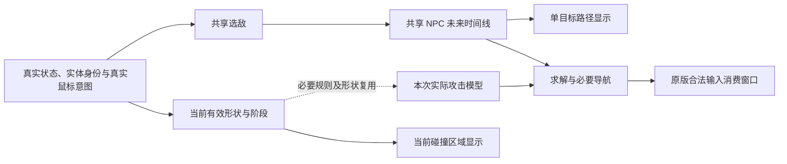

# 辅助瞄准阶段文档

## 1. 恢复工作先读

本文件是辅助瞄准阶段**唯一的活动恢复入口**，贯穿“两批开发、共享设计”：第一批交付当前碰撞区域显示、共享选敌及 NPC 预测与路径显示；第二批交付真实攻击建模、求解和辅助瞄准整合。位置和职责固定，内容随核验后的事实维护。

**当前只获准整理文档，不得开始第一批。** 本次任务为 [#112](https://github.com/Kuroneko2020/JueMingR/issues/112)，普通分支 `codex/aim-stage-documentation`。文档候选经过检查、独立只读恢复与语义复核、普通提交推送及 Draft PR 后，等待所有者审阅和后续第一批开发指令；不自动合并、关闭待审任务或创建并执行下一批任务。

- 快照核对：2026-09-29 02:46（Asia/Hong_Kong）；本次源码核对基线为 `47d5c0702ed903c389ec926d94048c2d1449e51e`，接管时干净 `main` 与正常 fetch 后的 `origin/main` 一致。本文自身提交由 Git 查询，不循环写回自身 SHA。
- 已有基础：G11A [#110](https://github.com/Kuroneko2020/JueMingR/issues/110) 已关闭、[PR #111](https://github.com/Kuroneko2020/JueMingR/pull/111) 已合入；它是本阶段依赖，**不是完整自瞄已实现**。第一批、第二批尚未实施、当前均无实施授权。
- 当前恢复点：核对本任务文档候选及审查记录，处理有依据的文档问题。最新候选、审查、提交和 PR 状态以 #112 为准；本文第 6 节是带基线的有限快照。
- 本轮禁止：生产、测试、脚本、项目、依赖、配置结构、资源、CI 或测试选择改动；预测 PoC、夹具、空接口、假开关；构建、产品测试、workload、图形验证、打包、安装/卸载、启动或操作游戏及真实角色、世界、用户配置。旧任务的 main、合并和安装权限不延续。

恢复顺序保持为 [AGENTS](../../AGENTS.md) → [文档入口](../README.md) → [稳定起步路线图](稳定起步路线图.md) → [#7](https://github.com/Kuroneko2020/JueMingR/issues/7) → 当前任务 Issue → 必需规范/ADR → Git 身份与实际差异。随后用本文件恢复阶段上下文；不能用其旧快照把代码退回旧状态。

### 本文件与正式事实源

[文档治理规则](../规范/文档治理规则.md)通常禁止稳定文档复制动态任务状态。所有者在 #112 明确授予的**有限例外，仅允许本活动阶段文件**保存核对时间、源码身份、来源和简要步骤进度。它不修改 AGENTS、长期规范、已接受 ADR 或路线图，不建立全项目状态文档制度，也不是第二套审批或独立状态账本。

Issues 仍是当前任务状态和授权的权威记录，Git 证明实际文件变化，原始验证记录证明对应版本和场景的结果。先核验并维护对应任务记录，再同步本文受影响快照；更晚的事实优先。普通陈旧事实自行查证并更新，真正的授权/行为冲突才停止相关写入并报告。既有正式合同承载 G11A 等已接受行为；下面明确标为“所有者决定”的内容是本阶段目标，尚未实施的目标不能反写成现行能力。

## 2. 最新已确认决定

本节依据 #112 所记录的所有者本次指令，结合原文第 1—11 轮仍有效的决定；**不是从摘要措辞或资料数量推定批准**。

### 产品关系与独立开关

R 是不依赖 tModLoader 的原版 Terraria 客户端辅助工具，不只是 Z 的原样重写。Z、DISNative 提供行为、机制和失败证据，不是整套移入的框架、生产依赖或获准分发的资产；定位仍见[根 README](../../README.md)及 [Legacy 规则](../规范/Legacy平替与行为契约规则.md)。

辅助瞄准、当前碰撞区域显示、NPC 未来路径显示为三个独立能力，各有开关、按需共享观察。NPC 路径计算由独立共享职责承担，自瞄和路径显示可分别使用或同时使用，不能各算一份等价预测。

路径只显示按当前选敌设置选出的**一个目标**，自瞄关闭也能显示；两者同时运行维护共同目标身份及相应预测，不悄悄各选一只。单目标限制显示对象，不禁止必要的关联实体读取和其他候选评估。暂时没有攻击解不应关闭独立路径显示。

### 选敌与 UI

**保留“清线优先／最近优先”切换。旧摘要 D03 的“删除最近优先”已被本次决定替代。** 两模式的最终评分、稳定性和可达性处理待后续设计，不能直接冻结 Z 的经验常数。

辅助瞄准保留一张大卡片，组织和内部相对排布参考 Z 的真实页面，包含：主开关与后方开关快捷键入口；清线／最近；玩家／真实鼠标中心；追踪人偶；瞄准标记；鼠标中心半径滑条及原有相关表现。不能将每个子设置拆成一整行平铺。碰撞区域显示和 NPC 路径显示各为独立功能条目，各有正常开关、开关快捷键入口及相应提示，不能绑成一个总开关。

功能文案参考 Z，呈现、控件、名称提示、保存和绑定采用 R；主功能的通用开关反馈和后方绑键入口不能遗漏。具体按 [F5 基础与玩家可见文案](../设计/F5控制界面样板与UI基础.md)、[短提示默认接入](../功能介绍/本地短提示与快捷键反馈行为合同.md#后续功能的默认接入)及其[实现接入](../设计/本地短提示与快捷键反馈实现设计.md#后续消费者接入)处理。卡片内子选项不因此自动新增独立快捷键或第二份配置，普通 F5 点击也不因此新增开关浮字。

自瞄关闭不能整体禁用卡片，共享选敌设置仍须服务路径显示。第一批没有自瞄执行时，共享参数也要有可用入口；过渡呈现留后续设计，不搭可开启却无真实后端的假自瞄功能。Z 用半径零间接关闭的旧耦合不自动成为 R 的独立开关合同。

“两条新行紧接自瞄卡片，其后保留现有战斗行顺序”仅为此前网页**建议**，不是已逐项确认的新布局。具体颜色、线宽、近似形状表示和新条目细部位置也尚未定稿。

### 攻击阶段：已澄清的外星霰弹枪语义

从点击到泡泡出现、再到真正生成子弹，是**同一次攻击较长的前摇／中间过程**。不能因泡泡已是 Projectile 就把真正子弹的瞄准排除为干涉已发攻击；一次点击松开也不机械等于这次攻击结束。

按“持续使用期间正常辅助；真正结束接管后，让已有攻击按原版继续”处理。普通子弹真正发出后不追改飞行；悠悠球、最终棱镜等合法持续使用，以及本次攻击必要释放／二段生成阶段仍可正常辅助。关闭自瞄、手动接管、换物和失效后的责任按真实阶段与现有合同界定，不能未经允许继续接管旧攻击。

这替代旧摘要 D12 周边尚待澄清的泡泡解释，不再向所有者重复询问“泡泡算不算已发出的攻击”。输入消费窗口、对象身份和阶段结束条件是实施者对照原版解决的工程问题；并非任意旧弹幕永久续租控制的授权。

### 继续有效的体验边界

- 目标是尽可能准确的短期可能路线和有帮助的瞄准，不要求不可改变的未来或百分百命中。攻击有效区域与目标受击区域要在**同一时刻**接触，不必击中中心；预计接触位置不一定就是光标位置。
- 慢弹、极复杂战况允许有依据的近似方向，保留玩家引怪、走位和开火主动权；不能无解就卡攻击、卡目标或无限计算。选敌范围、武器可达范围、预测窗口和可信度分别处理。
- 泡泡、猪龙鱼等可破坏敌方攻击物可参与选敌，不固定为永远优先，也不额外保护 Boss 不被转火。Boss 无敌不加额外操作或特殊保锁；遮挡按模式和实际攻击机制处理。
- 不增加临时绕过操作；玩家可用已设置快捷键关闭自瞄。真实鼠标表达选敌意图，虚拟瞄点或悠悠球导航点不能反过来改变选敌中心。
- 悠悠球要识别附近可行通路，并让原版球体绕过墙边缺口。不能因玩家到目标不直通就排除；也不能几何折线通了就称球体必然能走通。
- 特殊武器按机制覆盖，不缩为所有者随口列举的几把，包含最终棱镜。碰撞显示包括本人、队友的攻击及各自召唤物、哨兵；辅助输入只接管本人合法控制的对象。

五类碰撞区域保留原意并用不同颜色区分：

| 类别 | 含义 |
| --- | --- |
| 1 | 玩家攻击的有效伤害区域 |
| 2 | 敌怪可被攻击的身体区域 |
| 3 | 敌怪能伤害玩家、但不能被玩家攻击的区域 |
| 4 | 不能被普通攻击打掉的敌方射出物 |
| 5 | 可以被玩家攻击的敌方射出物 |

按玩法含义分类，不能因内部对象是 NPC 或 Projectile 而改类别。同一对象的受击与伤害区域可以不同；颜色表示用途与当前阶段，不自动表示安全。特殊形状不能全部画成“精确矩形”；具体配色、近似表达及短暂免疫的视觉处理仍待设计。

### 简短替代关系

旧材料中“泡泡不抢 Boss”“增加临时绕过”“Boss 特殊保锁”“只显示本人攻击”已被原文第 11 轮替代；“显示多个预测目标”被第 5 轮单目标决定收窄。摘要 D03 又被本次恢复最近优先替代，泡泡阶段歧义已由本次说明澄清。旧摘要的 `0745115` 仅是导出时身份，后续 G11A 窄修已经合入 `47d5c070…`，不能回退或重修已解决问题。其余有用机制保留为资料，旧命令、授权和 Agent 指令不执行。

## 3. 资料地图与已核对的入口

四份资料均在 `references` 现成目录内，已阅读全文和摘要；较大源码只针对阶段关键结论定向读取，未执行其中代码。原件被忽略，不随普通 clone/push 到达；来源与字节身份见[本地参考资料使用说明](../设计/本地参考资料使用说明.md#辅助瞄准阶段新增资料)。下面用仓库相对路径；`T`、`D`、`Z` 是阅读简称，不是依赖路径。

| 来源 | 实际入口 | 可证明什么及限制 |
| --- | --- | --- |
| 讨论原文 | `references/01_讨论原文.md`，2026-09-29 导出，讨论会话 `01a0e81d-103a-7ba2-93f1-3e75ad6c2b51` | 第 1—11 轮讨论及第 12 轮导出；区分用户决定与助手建议。重点第 9 轮完整机制清单、第 11 轮五项决定；本次决定优先于旧口径 |
| 交接摘要 | `references/02_交接摘要.md`，同次导出 | 提供定位与风险索引，D03、D12 周边解释和旧 HEAD 有上述替代；不是独立授权或验证证据 |
| 原版 T | `references/terraria/1.4.5.8/Terraria/Terraria/`；程序集元数据在上一层 `Properties/AssemblyInfo.cs` | 当前研究树自述 1.4.5.8。`Main.cs`、`NPC.cs`、`Player.cs`、`Projectile.cs`、`ID/NPCID.cs` 定向机制证据；不把旧 .6/.7 树当 .8，不把源码读取当运行 |
| DISNative D | `references/DISNative/`，源码 `src/` | `Prediction/NPCPredictionEngine.cs`、`Core/SimulationContext.cs`、`Physics/CollisionSolver.cs`、`Prediction/ProjectilePredictionEngine.cs`、`Core/WorldState.cs`、`Visualization/DebugRenderer.cs` 提供模型及局限对照；不是已安全隔离或已实测性能的框架 |
| Legacy Z | 同级 `../JueMingZ`，origin `Kuroneko2020/JueMingZ`；HEAD `6ac6356c0c564f43284590c168855e96c50e13f7`，核对时工作区干净 | 永久只读，源码事实与未跟踪旧说明分开；源码 SHA 不绑定未跟踪文档；不因资料缺失自动 clone 或整盘找替代目录 |

Z UI 要读真实 `src/JueMingZ/UI/Legacy/LegacyMainWindow.Pages.cs` 的 `DrawCombatPage`、`LegacyMainWindow.Rows.Combat.cs` 的 `DrawCombatAimAssistRow`，并对照 `Config/CombatAimModes.cs` 和 `UI/CombatAimMarkerOverlay.cs`。其当前源码展示策略、中心、人偶、标记和半径控件，标记是实际绘制消费者；这些是结构与行为参考，R 的控件/保存/绑定和本次独立开关决定优先。旧说明、调查中“有分类/有持续瞄准”不证明完整物理模型或实机命中。

本轮读到的 Z 标记以原版 LockOnCursor 贴图绘制三组旋转/脉动部件，不可用时回退十字与中心方框；`CombatAimMarkerOverlay.DrawMarker`（53—98）还会清无效目标锁并写回 selection，不能把它说成纯显示。R 参考视觉时仍由领域 owner 处理目标失效，不能依赖是否绘制来维持选敌正确性。

R 正式资料和当前入口：

| 入口 | 用途与当前边界 |
| --- | --- |
| [战斗辅助行为合同](../功能介绍/战斗辅助行为合同.md)、[实现设计](../设计/战斗辅助实现设计.md) | G11A 已接受五类节奏、独立转向、工匠可受击、汇报，以及使用权、四类未来瞄点接缝与异常收尾；自瞄仍后置 |
| [冻结战斗调查](../功能介绍/全功能调查专题/战斗辅助.md) §§2、9—11、16—19 | Z UI/资格/模型/标记/尾段与旧风险；该文 R 基线 `df8a029…` 已旧，不能据“R 尚未实现战斗”否认后来的 G11A |
| [战斗移动与钓鱼机制](../AI经验笔记/战斗移动与钓鱼机制.md) | G11A 原版阶段、异常回执，G10 开启无需求成本、暂借/归还，以及 Legacy release 经验；区分当前 R 与历史 |
| [总体架构](../设计/总体架构与状态所有权.md)、[F5 基础](../设计/F5控制界面样板与UI基础.md) | 唯一 owner、游戏线程观察/操作出口、UI 投影和真实输入归属；未来职责名不冻结为类名 |
| [CombatAim.cs](../../src/JueMingR.TerrariaHost/Combat/CombatAim.cs)、[CombatFacing.cs](../../src/JueMingR.TerrariaHost/Combat/CombatFacing.cs) | 实际文件名是 `CombatFacing.cs`，不是请求线索中的 `Facing.cs`。`CombatAim.Provider`、`host.Facing.TargetProvider` 是默认不存在的有限提供者边界，产品中没有完整选敌预测提供者 |
| [CombatUse.cs](../../src/JueMingR.TerrariaHost/Combat/CombatUse.cs)、[CombatInputScope.cs](../../src/JueMingR.TerrariaHost/Combat/CombatInputScope.cs)、[CombatHandoff.cs](../../src/JueMingR.TerrariaHost/Combat/CombatHandoff.cs)、[CombatProjectileReceipts.cs](../../src/JueMingR.TerrariaHost/Combat/CombatProjectileReceipts.cs) | 本次动作/物品/投射物身份、输入暂借、真实使用阶段、临时让路、回执收尾；不是未来通用尾段追踪器 |
| [ToolHooks.cs](../../src/JueMingR.TerrariaHost/Tools/ToolHooks.cs)、[HostInputState.cs](../../src/JueMingR.TerrariaHost/Input/HostInputState.cs) | 共享 ItemCheck/Projectile 入口和实际输入许可。异常回执按取得时所有者分派；F5、失焦和文本不能被扩大成所有自动业务停机 |

核对源码时优先按符号定位，行号只绑定本次资料字节。主线推进后先检查相关差异，不重做全游戏考古；缺少某个原件仅阻止依赖它的结论，其他整理可继续。

所有者于本轮确认：T 的 1.4.5.8 反编译由另一会话完成，DISNative 由所有者手动放入，来源无问题；不再列为待解决的资料缺口。本轮已核对 T 的自述版本与所列关键文件哈希，只做静态读取，没有重新反编译或运行验证。DIS 文档中的 1.4.5.8／2026-09-25 部署说法仍是第三方自述，来源确认不等于本轮验证了其部署或预测正确性。

## 4. 两批目标、共享关系与覆盖清单

下面是概念职责，不是批准的代码接口、类名、线程方案或算法。

只开碰撞显示读取当前形状，不因显示运行未来求解；只开路径使用选敌与 NPC 预测，不改光标、不偷偷执行完整武器求解或悠悠球导航。自瞄与路径同时开时，同一身份、时点、有效前提下复用同一时间线；不同需求长度由共享职责协调，不另建等价预测。关一个消费者不停止另一个；两者均无需求则停止相应未来计算，必要收尾与其它功能的观察另论。

时间线需要保留采样时点、目标身份、未来时间、必要受击区域与有效前提，不能只有渲染用屏幕折线。同 tick 或同槽号并不足以证明可复用。当前几何、预测、目标选择、输入和呈现分别由其真实职责拥有；按现有架构组织，不塞入巨型 Runtime/通用 Service，不预建全武器插件框架。

| 批次 | 用户结果与共享交付 | 这批不提前做的工作 |
| --- | --- | --- |
| 第一批 | 两个真实显示功能及其必要共享选敌、当前形状与 NPC 预测基础。包括挥砍、鞭子、光束等准确当前区域研究，向第二批保留时空形状和身份语义 | 完整武器未来求解、辅助输入、悠悠球导航；少量后续消费者的设计检查不构成实现许可 |
| 第二批 | 武器与实际弹药、发射位置、延迟、extraUpdates、阶段/碰撞规则、拦截求解、特殊持续控制/二段生成、悠悠球绕障；接标记、独立转向、G11A 五类节奏及现有使用权 | 不另造同职责选敌、NPC 预测或碰撞数据；不缩成只有普通枪箭，不要求开自动连点或快切才可独立自瞄 |

建议工作里程碑为：当前几何与只读性 → 共享预测与路径 → 第一批组合验证 → 实际攻击与求解 → 特殊控制与整合 → 整批交付。它们是恢复路线，不是逐文件硬顺序，不自动触发全量检查，也不要求所有者逐项批准普通技术选择。未来具体任务契约与实施授权仍须成立。

### NPC 覆盖：记录问题类型，不冒称全游戏已调查

下表各行的 **R 阶段实现均未实现，无新入口、无运行/精度验证证据**；已有 `NpcObservation` 与 `CombatFacing` 只提供基础观察/有限独立选敌。资料依据是原文及摘要的历史只读调查，只有第 5 节注明的关键点在本轮进一步核源码。初期代表场景用于检验方法，不缩减最终目标范围。

| 机制 | 资料依据 | 预期结果／所属批次 | 剩余限制与后续证据 |
| --- | --- | --- | --- |
| 惯性飞行、追踪、周期摆动 | 原文第 1 轮：恶魔眼、蝙蝠、黄蜂；T `NPC.cs` 对应 AI | 第一批：读 AI/目标/环境及惯性，滚动校正可能路线；第二批消费同线 | 身体移动与随机射击分开；后续比较预测与实际位置、碰撞/液体/击退后的恢复 |
| 地面跳跃 | 原文第 10 轮；冻结调查 §10.3 仅为 Z 启发式 | 第一批：区分落地、起跳、空中及环境约束 | 具体原版 AI 分支待查证，不把统一匀速线当完整预测 |
| 冲刺、阶段切换 | 原文第 10 轮及摘要 §5.1 | 第一批：阶段前提变化使旧线失效，明确可预测区间 | 代表 Boss 和随机分支需绑定版本、阶段及实际结果验证 |
| 瞬移 | 同上；Z 跳变重置是参考 | 第一批：不把跳变前后连成必经路径 | 目的地未知与已知规则分开，失效/重新获得证据待补 |
| 分节／关联控制体 | 原文第 10 轮 | 第一批：读必要头部/相邻节段，保留逐部位受击区域；第二批按真实区域求交 | 一节不能当独立世界，不合并成填满节段空隙的大矩形；关联范围待核 |
| 可破坏攻击物及受击阶段 | 原文第 4、11 轮：泡泡 NPC 371、猪龙鱼 372/373；T `NPCID.cs`、`NPC.cs` | 第一批：玩法分类、选敌资格与当前阶段；第二批：真实接触与伤害资格 | `ProjectileNPC` 名单和普通 `lifeMax>5` 过滤不等于需求；各阶段/普通敌怪/人偶回归待做 |

### 攻击覆盖：具名规则、类别适配、弹幕／弹药规则

依据原文**第 9 轮**和摘要 §6，19 种具名规则不是总范围；测试假名称/假 ID 不是原版物品。以下 **R 的本阶段攻击模型、求解和自瞄执行均未实现、未运行验证**。只有明确指出的 G11A 接缝/节奏已有代码，其历史验证见第 6 节，不能抵充本表预期结果。

| 机制与已调查样例 | 依据／现有 R 入口 | 预期结果与批次 | 剩余限制／应取得的证据 |
| --- | --- | --- | --- |
| 普通直射、延迟下坠、慢速投掷 | 原文第 2、7、11 轮；R 模型未实现 | 第一批当前形状；第二批真实弹速/弹龄/重力、范围与无解处理 | 木箭、玩家飞镖与手雷不可统一建模；对真实发射与命中，不用模型自证 |
| 特殊弹药：钱币枪 | 第 9 轮具名规则；R `CombatFacing.Weapon` 有资格特例，非弹道模型 | 第二批实际钱币与原版速度相加，第一批处理当前攻击区域 | Z 只取武器弹速不能继承；实际选弹和原点证据待补 |
| 天空落弹：代达罗斯风暴弓、血雨弓、流星法杖、星怒、StarWrath、月耀 | 第 9 轮；Z `CombatAimSpecialWeaponRuleResolver`；R 未实现 | 第一批现存区域；第二批出生位置、延迟、地形与光标语义 | 经验短提前量不证明真实发射/接触 |
| 持续引导：魔法飞弹、烈焰火鞭、彩虹魔杖 | 第 9 轮；R 未实现对应控制 | 第一批当前区域；第二批合法持续输入、松手与阶段转换 | 不能持续干涉真正结束接管的旧攻击；多对象身份/异常收尾待验证 |
| 平行多箭：海啸、叶绿连弩、幻影弓 | 第 9 轮；R 未实现 | 第一批当前多形状；第二批多原点/方向、实际弹药 | Z 发数/间距为模型参数，须对原版实际输出验证 |
| 散射：霰弹枪、三发猎枪、四管霰弹枪；玛瑙爆破枪的辅助弹 | 第 9 轮；R 未实现 | 第一批分类/当前形状；第二批散角、随机覆盖、主/辅助弹分开 | 不把确定一条轨迹冒称全部随机命中 |
| 外星霰弹枪：泡泡后生成真正子弹 | 第 8、9 轮及本次澄清；T `Projectile.cs` 二段生成；R 未实现 | 第二批同次攻击中间过程、各泡泡原点/保存弹种/速度与实际生成窗口 | “泡泡算不算已发”已决定；具体身份/有效接管窗口由原版核对，不新增任意尾部控制 |
| 漩涡击碎者：持枪控制体＋子弹/火箭 | 第 8、9 轮；R 未实现 | 第二批持续消费光标/重新选弹，主弹与自导辅助弹分开 | 控制体不等于子弹；资格不能仅看普通 friendly 弹幕 |
| 持续光束：最终棱镜、充能爆破炮；持续攻击样例星光、日耀喷发剑 | 第 9 轮类别适配；R 未实现 | 第一批真实当前形状；第二批逐机制模型，棱镜控制体/六束光、蓄力收束、宽度、转向与遮挡 | Z 有持续瞄准接入不等于精细棱镜求解；不能把四个样例全部当同一种光束 |
| 悠悠球、双球与配重 | 第 8—11 轮；G11A `WeaponCatalog`/`CombatUse` 有魔法绳节奏，无导航 | 第一批当前球体形状；第二批范围/惯性/持续时间、绕口控制与无进展恢复 | 后续验证墙边缺口、窄口、斜坡、无路、玩家移动、双球/配重；球心或几何折线可通不够 |
| 链球/连枷：猪鲨链球、阳炎之怒等 | 第 9 轮类别；G11A `FlailRelease` 与连击已有有限接缝 | 第一批当前阶段区域；第二批旋转/释放/继承速度/碰撞/返回与真实按松意图 | 不能混同右键合成 release 与左键物理 release；接缝不代表预测/尾段已做 |
| 回旋镖、长矛、挥砍、鞭子 | 第 2、8、9 轮；R 本阶段未实现 | 第一批即研究准确当前形状/有效时段；第二批去回程、伸缩/姿态及派生攻击 | Z 回旋仅去程近似、矛有分类不等于伸缩求解；不是全部延至第二批研究 |
| 释放/蓄力与五类节奏组合 | G11A `ItemRelease`、`FlintCharge`、`GlacierCharge`；原文第 9 轮相邻消费者 | 第二批接自瞄且保持独立使用；第一批观察当前区域 | 快切 23 项不等于瞄准覆盖数，燧石/冰川之牙读取阶段不同；完美左轮/快切/魔法绳不是另三套算法 |
| 自导/修正：叶绿弹、叶绿箭、漩涡火箭、幻影箭、SpectreWrath、Bat | 第 9 轮 Z 分类；R 未实现 | 第二批核原版选敌、转弯、速度及初始可达性 | Z 类别未逐项证明，辅助弹不是额外玩家武器，实际追踪目标可能不同 |
| 光束弹种：HeatRay、LaserMachinegunLaser、MartianWalkerLaser、LastPrismLaser | 第 9 轮 Z 分类；R 未实现 | 第一批真实形状与当前阶段；第二批按来源和原版机制建模 | 含敌方弹幕；不得把名单直接变成玩家武器清单 |
| 重力/转换：雪球、毒刺矢、杰克南瓜灯、玉米糖；发射器映射、gunProj、箭袋/箭术、extraUpdates | 第 9 轮；T `Player.ItemCheck_Shoot/PickAmmo`、`Projectile.Update`；R 未实现 | 第一批当前形状；第二批实际弹药转换、子更新和速度 | 火箭/榴弹/感应雷/雪人炮/喜庆弹射器 Mk2，幻影弓/幽灵凤凰等按机制查证；测试 ID 不代原版 |
| 反弹、穿透、爆炸、分裂、命中派生、光标处生成 | 原文第 7—10 轮；R 未实现 | 第一批当前有效区域；第二批阶段事件及派生攻击 | 保留待查类别，不为本次填表重查全游戏；未来代表验证不能冒称每把均覆盖 |

## 5. 关键风险与后续验证落点

本节把**本轮读到的静态事实、历史调查和后续责任分开**。没有运行预测器、原版 AI、产品测试或游戏，不提供命中率、精度、耗时、FPS 结论。

| 主题与依据 | 风险／限制 | 后续应验证的结果 |
| --- | --- | --- |
| 只读隔离：T `NPC.Clone`（95854—95856）使用 `MemberwiseClone`；D `NPCPredictionEngine`（257—312、376—409）在活对象运行 AI 后恢复字段；T `Projectile.Damage_GetHitbox`（15038—15062）在 type 301/383/262 分支写 `localAI[0]` | 本轮确认 DIS 恢复列表遗漏 `timeLeft/despawnEncouraged`；T `NPC.AI`（20110—20114）可调用 `EncourageDespawn`（7276—7283）写入两字段。是实际静态调用链反例，未实机复现污染。浅拷贝、finally 不证明隔离，不能照搬；也不能全部 NPC 匀速退化后称完整预测 | 正常/异常/中断不改真实实体、数组、玩家、世界、随机序列或生成行为；采集形状不多执行伤害逻辑。隔离方案尚未选定 |
| 时间与身份：本轮核对 T `Main.cs`（17962—17986）相应更新分支为玩家→NPC→弹幕，`Projectile.cs`（16781—16784）按 `extraUpdates+1` 子更新；R 的 session/selection/operation、NPC generation、Projectile key | 击退可能晚于 NPC 本步位移；各条件分支和伤害时点仍需对应采样窗口。同 tick/槽号不足以复用，浅身份会串到重生对象 | 对齐采样和未来时刻；槽复用、变身、传送、阶段、武器/弹药和多人修正使相关旧结果正确失效；迟到结果不能复活 |
| 实际命中：T `Projectile.Damage/Colliding`、近战/鞭子/光束专用形状；原文第 10 轮 | 几何接触、有效伤害阶段、实际伤害是不同结论；免疫、穿透、遮挡、owner、节段空隙、派生攻击影响结果 | 使用独立的原版事实/受控真实链及获准实机比较；预测器和自己的假模型不能互相证明。显示近似必须诚实 |
| 可达性与模式：原文第 8、11 轮及最新两模式决定 | 清线不是所有武器的玩家—目标直线 LOS；最近不能长期压住明显不可达目标。范围、窗口、可信度不同，无窗口解不等于永远打不到 | 近程、慢弹、目标进入范围、换武器、绕口、无路与无进展恢复；不阻止原版攻击、不无限求解、不因无攻击解关闭路径；只开路径无完整武器求解 |
| G11A 接入：当前 `CombatAim.cs`、`CombatFacing.cs`、`CombatUse/CombatInputScope/CombatHandoff`、`ToolHooks` | 提供者目前是窄接缝；四阶段不覆盖普通自瞄。`FacingTarget.Valid` 再调 `CombatFacing.Targetable`，普通 `lifeMax>5` 和人偶过滤可能丢弃未来合法共享目标 | 第二批适配目标消费与独立转向回退，保护普通敌怪/人偶/107边界；四类释放/蓄力、暂借、取消、异常、迟到/重复回执和半途借出均验证。本轮不修源码 |
| 相邻功能：现有使用 owner、输入许可及战斗/钓鱼设计 | 工具采集/挖矿、借网、钓鱼、快捷物品、提炼、未来蓝图有自己的操作位置；临时借用、真实换物、永久结束不是一个状态 | 自瞄坐标不覆盖非战斗目标；按实际归属暂停/归还/退休自身责任，不能一个开关全局禁用。F5、失焦、文本和原版界面不扩大为全部输入/自动化停止 |
| 性能：原文第 4、6、7 轮结构估算；[性能规则](../规范/性能治理规则.md)与[工作量入口](../设计/高频路径工作量回归.md#自动入口与维护位置) | 重复扫描、从零前推、逐候选完整求解和有效路线逐更新重规划是需处理的无用工作；未测出卡顿不构成延期理由 | 覆盖全关、开启无目标/无合法需求、稳定、条件变化、无进展、必要收尾及三开关组合。共享观察预测，不停合法功能、不丢释放阶段、不增加明显延迟换低计数；实机性能另证 |
| 兼容与呈现：[平台规则](../规范/技术平台与兼容规则.md)、[测试规则](../规范/测试与审计规则.md)、F5 合同 | 本机预测几何不是服务器已确认伤害；键鼠、手柄/原版锁定、逆重力、镜头/缩放和多个控制体不能互相代证 | 单人、本地联网观察、Host & Play 权威执行、独立服务器分别记录；手柄/锁定按现有合同继续查证，未明的标注未知，不默默承诺或删支持 |

必要触发识别和实时观察允许存在。本阶段不新设“空闲零调用”“永不全表扫描”“固定每 N 帧”、统一毫秒预算或固定预测长度硬门。原文 1—2 秒是短期预测讨论尺度，7,200 NPC 步/秒等数字是特定全量重算假设下的操作估算，不是既定实现参数或实测帧时。方法、重用策略和参数由后续实施者依据真实机制和证据选择。

### 当前四类瞄点接缝及停止责任

| 接缝 | 当前源码允许的阶段 | 不能据此宣称 |
| --- | --- | --- |
| `ItemRelease` | 当前快切物品在合法释放 ItemCheck 窗口临时借鼠标 | 普通自瞄、工具/钓鱼/快捷物品的目标已接入 |
| `FlailRelease` | 当前本地链球 `ai[0]==0`、channel 已释放的 AI | 已有释放后专用追踪或任意旧链球接管 |
| `FlintCharge` | 燧石 5462 对应投射物的蓄力阶段 | 释放时改鼠标即可改原版已存方向 |
| `GlacierCharge` | 冰川之牙 6153 保持 channel、指定原版读取瞄点阶段 | 与燧石/物品释放同门，或直接改弹体速度 |

当前请求绑定 player/weapon/slot、session/selection/operation、Step、Stage 及必要 projectile/key；结果回指同次请求且坐标有限，动作消费端再核身份。无提供者不建请求/找敌/准备弹道，失效或抛错回原手动点。新能力应复用受控出口，并按真实阶段补足责任，不能把这些接缝的存在等同完整后端。

## 6. 已核对进度快照与当前恢复点

快照日期、源码基线见顶部；来源为本轮 Git/GitHub 与定向源码读取、原文/摘要及下列历史记录。文档任务的后续审查、提交、PR 身份由 #112 维护；**本快照不抢先把尚未记录的审查或所有者接受标为通过**。

| 内容 | 已经成立 | 尚未成立／证据边界 |
| --- | --- | --- |
| G11A 依赖 | 五类武器节奏、独立转向、工匠可受击、自动汇报和异常收尾修复有代码，#110 已 completed、#111 已合入 `47d5c070…` | 不是本阶段完整自瞄/预测/显示。新修复实机、真实多人、键鼠/IME和 FPS 尚未验收 |
| G11A 工程与交付证据 | [最终验证和独立审查记录](https://github.com/Kuroneko2020/JueMingR/pull/111#issuecomment-5875573361)绑定 `a8d7863…`，记录 Release Related 98 项及实际 Release 链；[合并收口](https://github.com/Kuroneko2020/JueMingR/issues/110#issuecomment-5875615882)记录与合并树一致 | 本轮读取这些历史记录，没有重跑或升级为本轮测试。按历史交付保留安装仍为 `0745115…`，不含后续窄修；本轮未核验安装现场、未打包/安装 |
| 自瞄阶段研究 | 原文、摘要已有算法、特殊机制、UI 和风险调查；本轮补核关键源码，形成两批共享目标与覆盖清单 | 没有预测精度、命中率、FPS 或全 NPC/全武器支持证明；概念设计不等于生产实现 |
| 本次阶段文件 | #112 明确授权，唯一文件及正常读取路由在本候选建立，资料来源有入口 | 本候选待文档检查/独立复核及所有者审阅的实际结果以 #112 为准；未合并 main，不等于阶段产品交付 |
| 第一批 | 范围及共享关系已由所有者选择；可查现有观察/呈现基础 | 当前碰撞显示、共享选敌、NPC 预测/路径显示本阶段尚未实施，无对应运行验证、包、安装、实机接受或合并；无实施授权 |
| 第二批 | 攻击机制覆盖与接缝风险已有研究，依赖第一批共享数据 | 实际攻击模型/求解/特殊导航/自瞄执行/标记组合尚未实施，无对应验证、包、安装、实机接受或合并；无实施授权 |

已有 G11A 原始窄修记录位于 `.local/g11a-combat/projectile-closeout/`，如 `red-observed.log`、`green.log`、`formal-release.log`、`release-native.log`，原身份和哈希由上述 PR 评论承担；这里不复制日志或把历史失败抹为“风险已排除”。

**下一步入口**：先看 #112 的实际文档候选和独立审查结论，处理文档反馈后等待所有者指令。收到第一批开发授权时，先更新/核对对应任务与白名单，再沿本文件第 2、4、5 节补具体行为合同、共享数据与验证安排。计划里列出里程碑本身不授权施工。

### 阶段内维护与恢复

重要决定变化、可验证里程碑完成、有效实验推翻方案、关键阻塞确认或准备交接时，先更新任务事实，再同步本文受影响内容和简短恢复点。不逐工具调用记流水，不每次编辑重写全篇，不为状态微调反复提交或触发产品测试。

恢复后检查当前分支/HEAD、main/origin/main、工作区/暂存区、#7 与当前任务；对比自上次快照以来的真实变化及证据，再继续获准工作。读过模块、TODO、编译或自动绿灯都不能升级为能力完成；部分完成保留剩余范围，失败保留触发场景与证据。过期快照更新即可，不能回退实际代码去迎合快照。

阶段始终维护此文件，不按会话复制“总控/交接/当前状态/新版计划”。第一批结束继续为第二批保留入口。整个阶段结束时，长期合同、设计与经验回到各自正式载体，阶段文件按届时授权及现行生命周期退出活动路由；本轮不删除原件、不预定未来删除方式，也不扩成永久全项目状态总账。

## 7. 未决事项与已排除方案

尚需后续设计的体验细节：第一批共享参数的真实可用入口、具体配色/线宽/近似形状表示、两条显示功能的细部位置、人偶与显示分类的组合、PvP 显示边界。追踪人偶开关本身已决定，不能又写成是否保留待定。手柄/原版锁定的实际支持边界先查现有合同和消费者，证据不明再标注；不凭本文件承诺。

工程选择由实施者在后续授权内负责：两模式评分/稳定性与真实可达关系，预测隔离方案，玩家未来运动假设、随机/关联实体/既有弹幕击退的采纳条件，形状采样时点，攻击阶段身份/终止，预测长度、失效和重规划条件，合理近似/无解处理及绑定场景的验证指标。这些没有在本轮冻结算法、接口、常数或百分比门。

明确排除：整套搬入 Z/DIS；在活对象多跑 AI 再有限回滚就称安全；只画矩形就称全部精确碰撞；全部 NPC 匀速线就称完整预测；两个消费者分别选敌/重复预测；普通箭弹发出后追改；Boss 特殊保锁/可破坏物永远优先；额外临时绕过键；真实结束后无限控制旧弹幕；单靠 LOS 排除悠悠球绕口；用停功能或遗漏收尾换性能；第一批搭假自瞄；19 种具名规则封顶范围；把只读研究当实机结论。

四份指定资料本机均已找到，来源已按上述所有者确认记录，无待解决的资料缺口。第三方版本自述及未实测范围以资料说明为准；原件不会随 Git 交付，其他机器缺少时记录准确缺口，只停止依赖结论。文档候选完成后停在审阅，不因本清单存在而自动创建开发任务。
