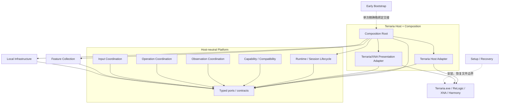
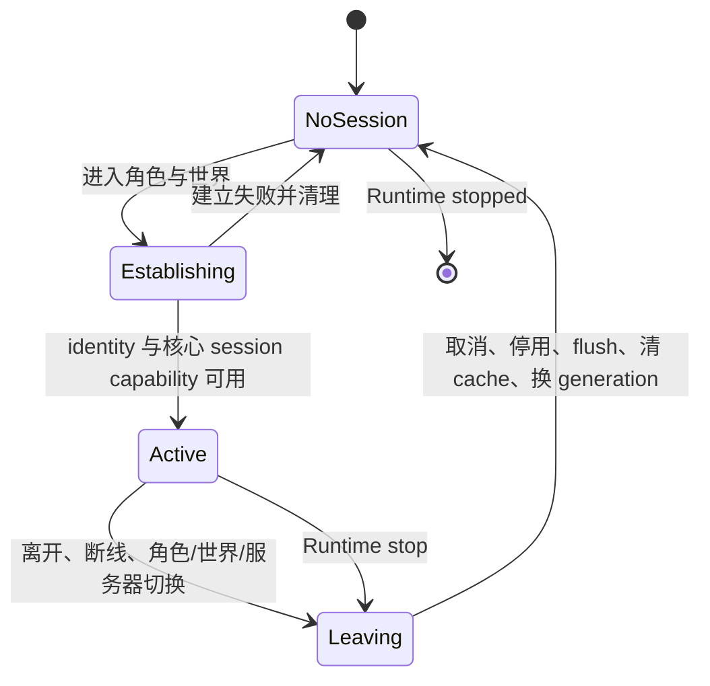
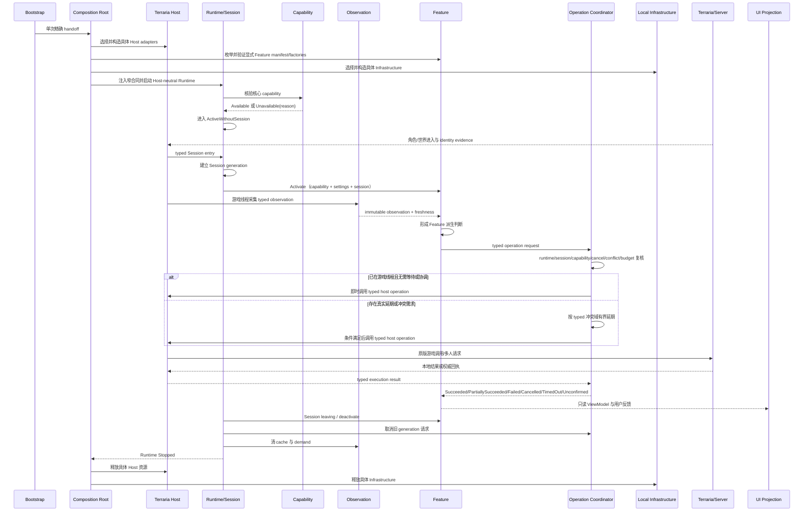

# 总体架构与状态所有权

- 状态：草案
- 生效条件：只有 ADR-0010 被项目所有者接受、正式路由更新并合并到 main 后，本设计才成为当前正式架构。
- 当前效力：本文件当前不授权创建项目骨架、生产代码、测试、依赖、构建、CI、安装器或具体功能。
- 对应任务：[Phase 0-Q Issue #21](https://github.com/Kuroneko2020/JueMingR/issues/21)
- 决策依据：[ADR-0010：总体架构与状态所有权](../决策/ADR-0010-总体架构与状态所有权.md)

## 1. 设计目的

本设计描述 JueMingR 当前候选系统应怎样组织，目标是让下一阶段能够建立最小项目骨架，并让后续功能在不复制 JueMingZ 内部结构的前提下逐项进入。

本设计要同时保证：

- 原版 Terraria 同进程产品身份不变；
- 最早加载职责保持最小；
- Terraria、ReLogic、XNA 和 Harmony 依赖被限制在一个宿主边界；
- 每种状态只有一个权威 owner；
- 功能可以观察游戏，但只能通过受控出口请求修改游戏；
- UI、持久化、Diagnostics 和 cache 不能成为第二事实源；
- 功能内部按用户能力纵向内聚，功能之间默认隔离；
- 关键边界以后可以由项目引用、类型或架构测试执行；
- 当前证据不足的细节能够在真实骨架、加载链和首个纵向切片中受控校准。

## 2. 非目标

本设计不：

- 创建 `.sln`、`.csproj`、源码、测试、依赖、构建脚本或 CI；
- 选择具体 DI 容器、UI 框架、序列化库或 NuGet 包；
- 固定所有项目名、接口名、类名或方法签名；
- 为每个候选功能预建类型或一个程序集；
- 决定各功能的完整 schema、Legacy 数据导入或用户可见差异；
- 固定首个 Hook、重试次数、缓存容量、Tick cadence 或性能预算；
- 建立通用进程外控制面或把游戏状态搬到外部进程；
- 声称架构已经通过编译、加载、实机、多人或性能验证。

## 3. 架构驱动因素

### 3.1 已批准产品与平台边界

- JueMingR 是 JueMingZ 的独立重写。
- 游戏内组件进入原版 `Terraria.exe` 同一进程，不依赖 tModLoader。
- JueMingR 只安装在客户端，不建设专用服务器组件。
- 当前研究基线是 32 位 CLR 与 .NET Framework 宿主；下一阶段必须从目标游戏重新验证 PE/CLR、位数、ABI 和可用目标框架，不能把历史 x86 或具体 TFM 猜测写进骨架。
- 普通用户加载路线继续使用受控 config、最小 AppDomainManager、最小早期初始化、核心能力门、单一 Harmony 上下文、经验证宿主回调和一次 Runtime 交接。
- 安装、检测和恢复必须能在 Terraria 进程外完成。

### 3.2 长期维护边界

- 后续 Agent 应能在有限上下文中理解单个模块或 Feature。
- 依赖方向和直接宿主引用不能只依靠文字自律。
- 共享能力只在存在多个真实消费者，或存在不可重复的安全、线程或生命周期职责时进入平台。
- 功能关闭、不可用或失败时，领域工作、排队、cache 和后台任务必须可停止或清理。

### 3.3 Legacy 证据边界

Legacy 定向静态调查把 Early/Late 分离、强类型 Harmony、自然数据归属、typed action request、同 Tick共享观察和有界诊断识别为候选保留职责；也把全局 Runtime、Manager、Registry、巨型设置、全量快照、多写入者和多重 fallback 识别为架构风险。这些仍需由骨架、代表性切片和相称运行证据验证，不能从静态形状推断运行收益或玩家影响。

本设计保留职责和安全性质，不保留 Legacy 类名、项目划分、schema 或调用链。

## 4. 推荐架构总览

推荐采用：

> **以端口和适配器限制宿主依赖的分层模块化单体；共享平台只承担不可重复的安全与生命周期职责；具体用户能力在 Feature 集合内按纵向切片实现。**

“模块化单体”表示游戏内部分仍是一个共同部署、共同生命周期的产品，不引入微服务、插件市场或跨进程业务协议。“分层”表示依赖方向有明确内外之分。“功能纵向切片”表示每项用户能力拥有自己的规则、状态、配置语义、ViewModel 和失败降级，而不是把所有业务分别塞进全局 Service、Manager 或 UI。

推荐方案吸收纯纵向切片的局部内聚，但不允许每个功能重复 Host、线程、identity、操作安全和机械存储；保留最外层 Composition Root 的唯一具体装配，以及 Host-neutral Runtime / Session Lifecycle 的统一生命周期机制，但拒绝无类型 Event Bus、Service Locator、全局快照和插件内核。

## 5. 部署单元

### 5.1 Terraria 进程内 JueMingR 包

游戏内包包含：

- 最小 Early Bootstrap；
- 宿主无关平台，包括 Runtime / Session Lifecycle；
- Feature 集合；
- Terraria Host Adapter 与最外层 Composition Root；
- 运行时需要的本地持久化和 Diagnostics 适配器。

源码边界保持为独立项目或程序集。最终分发可以在满足许可证、装载身份、hash 和单一上下文要求的前提下组合为低摩擦包；部署合并不得反向取消源码依赖边界。

### 5.2 Terraria 进程外 Setup/Recovery 工具

进程外工具负责：

- 定位合法 Terraria 安装，并检查静态先决条件、文件身份和已知冲突；这些预检结果不发布或替代进程内 Runtime capability；
- 检测既有 config、AppDomainManager 和文件冲突；
- 受控部署、manifest、hash、唯一备份和原子替换；
- 安装中断、加载失败、更新冲突后的恢复；
- 幂等卸载且只删除 JueMingR 拥有的文件；
- 发布包身份、许可证和完整性检查。

它不得成为 Runtime 正常运行依赖，不通过 IPC 读取活游戏状态，不承担普通 Feature、UI 或数据处理，也不扩张为通用外部控制面。

## 6. 逻辑模块与职责

下表中的名称是职责标签，不预先固定最终命名。

| 模块 | 唯一职责 | 允许依赖 | 禁止依赖 | 拥有的状态 | 不拥有的状态 | 生命周期与对外面 | 失败后结果 |
| --- | --- | --- | --- | --- | --- | --- | --- |
| Early Bootstrap | 在 CLR 最早入口观察明确宿主条件，维护最小加载状态机并完成一次固定的 Host handoff | BCL、受控程序集身份信息 | Terraria 静态状态、Harmony 业务调用、配置迁移、Feature、UI、Persistence、Diagnostics | Bootstrap 阶段与交接结果 | Runtime、Session、Feature 或游戏事实 | 进程开始至交接或终止；仅暴露一次 handoff | 终止激活并提供进程外可恢复证据；不得半激活 |
| Composition Root | 位于最外层，选择具体实现、验证依赖、构造对象图，并通过抽象入口启动和关闭 Runtime | 具体 Host adapters、Feature Collection、Local Infrastructure、Host-neutral Platform | Feature 业务规则、运行期 Service Locator、Session 或 Feature activation 决策 | 仅装配阶段的局部进度与失败结果 | Runtime、Session、Feature activation、Feature 内部状态、游戏事实 | 固定 handoff 后的装配阶段与最终关闭阶段；不暴露运行期服务解析 | 装配失败时释放已构造对象，Runtime 不进入 Active |
| Runtime / Session Lifecycle | 以宿主无关状态机推进 Runtime、Session 与 Feature activation，并规定启动、停止、世界进入、退出和清理顺序 | 抽象 lifecycle、session、feature activation、capability 合同 | Terraria/ReLogic/XNA/Harmony、具体 Feature、具体 Host Adapter、具体 Infrastructure、Composition Root | Runtime、Session、Feature activation 状态与顺序 | Feature 产品清单、Feature 内部状态、Terraria 原始事实、具体装配 | 对象图交接后至 Runtime stopped；发布只读 lifecycle/session view 和窄回调 | 核心失败安全停止；单 Feature 失败局部停用，不拖垮 Runtime |
| Capability / Compatibility | 汇集 Host 探测证据，发布唯一的核心与共享 Host capability 事实及原因 | Host probe 结果、目标身份、typed capability declarations | 自行决定 Feature 产品规则、用版本号替代能力、把探测写成实机验证 | 核心与共享 Host capability 状态 | 用户期望开关、Feature 可用性结论、Feature 运行状态 | 进程或 Session；提供只读 capability view | 核心缺失阻止激活；可选能力缺失供对应 Feature 判定 |
| Terraria Host Adapter | 唯一直接适配 Terraria、ReLogic、XNA、Harmony，并实现观察、最小操作、Hook、raw input 和宿主 capability probe 端口 | 宿主无关平台端口 | 具体装配、Feature 业务规则、持久化语义、Diagnostics 决策 | Hook 句柄、宿主连接、线程身份和 probe evidence | Terraria 原始事实、Runtime/Session、Feature 可用性或运行状态 | Host 晚期激活至 Runtime stop；提供 typed host ports | 释放自身句柄；报告 capability 或 operation 失败 |
| Observation Coordination | 在游戏线程按 demand/cadence 产生 typed 只读观察并管理 freshness | Host read ports、Session/capability | 直接修改游戏、全功能巨型快照、把 cache 当事实源 | 当前 Tick观察与明确声明的 observation cache | Terraria 原始事实、Feature 派生判断 | Session/Tick；提供 typed observation | 返回 unavailable/unknown reason，不编造值 |
| Operation Coordination | 作为所有游戏 mutation 的统一 typed 逻辑安全边界，复核请求并选择即时执行或按真实需求有界延期 | Host operation ports、Runtime/Session/capability/activation view | Feature 目标选择、产品规则、特有幂等或资源守恒语义、字符串业务分派、全局工作流或调度 | 通用安全门、可选 typed 冲突租约/延期状态、执行与结果状态机 | Feature 业务状态、全局单队列、Terraria 权威事实 | 单次请求或有界延期；typed request/result | 返回拒绝、失败、取消、超时、部分完成或未确认；不假成功 |
| Feature Modules | 通过显式产品清单声明稳定 identity；每项功能拥有自己的可用性结论、规则、派生判断、领域状态、数据语义、语义 ViewModel 和清理 | 宿主无关平台 ports/contracts | 具体 Feature、Terraria/ReLogic/XNA/Harmony、文件路径、Service Locator | Feature 产品清单、Feature 可用性与内部运行状态、Feature 持久事实语义和投影 | Host、Feature activation、输入 owner、机械存储、诊断 buffer | 构建身份/activation/Session；最小 Feature contract | identity 冲突令 composition fail closed；单项失败自身停用和清理 |
| Terraria/XNA Presentation Adapter | 渲染 Feature/Settings 提供的只读 ViewModel，维护布局与交互瞬时状态，并把用户操作转发为明确命令 | Feature/Settings presentation contracts、Terraria/XNA renderer | 重新解释业务状态、直接写游戏或文件、以控件状态拥有业务事实 | 窗口、滚动、layout、hit-test 等瞬时展示状态 | 语义 ViewModel、Feature 业务状态、持久事实、游戏事实 | UI/Session；只读 model + command | 显示 unavailable/error；不把错误伪装为空态 |
| Input Coordination | 仲裁焦点、鼠标、键盘、滚轮、热键和游戏输入隔离 | Host raw input、Presentation interaction requests | Feature 业务和 Terraria mutation | 当前帧或交互的唯一 input owner | 用户设置语义、Feature 运行状态 | Frame/interaction；typed input commands | 释放 capture，拒绝冲突，不复活已消费输入 |
| Settings | 拥有全局偏好、功能期望开关、快捷键绑定及其命令语义 | Local persistence port、Feature setting declarations | Feature 运行状态、Host、直接路径和文件写入 | 全局 settings 事实与 revision | Feature 持久事实、机械文件状态 | 进程；只读 snapshot + typed command | 保留原件并显示读取/冲突原因，不静默覆盖 |
| Local Persistence Adapter | 提供逻辑 scope/document key 到本地路径根的映射，以及原子字节读写、备份、恢复和冲突检测 | 宿主无关 persistence contracts | Feature 业务含义、全局 schema 总管、Terraria | 机械 I/O 事务、文件 identity 和失败状态 | Settings/Feature 数据语义 | 进程；机械 document store | 不覆盖损坏、较新或并发变化的事实源 |
| Diagnostics | 消费模块主动发布的有限状态、结果和事件，提供有界支持证据 | typed diagnostic publications、机械 sink | 反射扫描对象、主动重算业务、改变 operation 结果、成为运行前提 | 有界诊断副本、容量和丢弃计数 | 任一业务事实 | 可按需启停；snapshot/export view | 丢弃或停采并报告，不影响业务结果 |
| Setup / Recovery | 拥有安装、备份、恢复、卸载和 manifest 事务 | 文件系统、安装发现、发布身份 | 活 Runtime、游戏内 Feature、通用 IPC 控制 | install generation、manifest、backup/recovery 状态 | Runtime、Session、用户业务数据语义 | 独立进程；显式用户操作 | 冲突时停止，保留证据和精确恢复路径 |
| Test Support | 未来提供隔离 fixture、fake host 和架构检查辅助 | 公开或 internal test seam | 用户真实目录、生产事实 owner | 测试进程内隔离状态 | 产品状态 | 只存在于测试部署 | 失败只影响测试，绝不写真实用户数据 |

## 7. 模块依赖图

箭头表示源码引用或明确运行时使用方向；虚线表示部署或晚绑定交接，不表示普通模块可以动态解析服务。



只有 `Terraria Host + Composition` 可以引用游戏二进制与 Harmony。Composition Root 是唯一可以同时认识具体 Feature、Host Adapter、Local Infrastructure 和 Host-neutral Platform 的最外层装配位置；Host Adapter 不构造对象图，Runtime / Session Lifecycle 也不认识这些具体实现。

Composition Root 只在装配与最终关闭阶段使用具体对象。装配完成后，各模块只通过已经取得的窄合同协作；Root 不提供运行期 Service Locator，也不允许其它模块在运行时回到 Root 任意解析服务。

Early Bootstrap 不引用 Platform、Feature 或游戏二进制；它在确认宿主条件后，用固定程序集身份和固定 handoff 形状完成一次晚绑定交接。该 seam 不是 Service Locator，不允许按字符串任意解析业务服务。

## 8. 依赖允许表

| 来源 | 可以引用或调用 | 目的 |
| --- | --- | --- |
| Early Bootstrap | BCL、固定 host payload identity/handoff | 最早装载与一次交接 |
| Runtime / Session Lifecycle | Host-neutral Platform 内的 lifecycle、session、feature activation、capability 合同 | 推进长期状态与清理顺序 |
| Host-neutral Platform 其它机制 | 自身内部的稳定合同与 Host ports | capability、observation、operation、input 协调 |
| Feature Collection | Host-neutral Platform | observation、operation、settings、persistence、presentation、diagnostics 合同 |
| Local Infrastructure | Host-neutral Platform 的机械端口 | 实现存储和 diagnostic sink |
| Terraria Host adapters | Host-neutral Platform | 实现 host read/write/render/input ports |
| Composition Root | Platform、Features、Local Infrastructure、Host adapters | 仅在最外层选择实现、验证依赖、构造对象图并启动/关闭 Runtime |
| Setup/Recovery | 自身文件和安装合同 | 进程外事务 |

## 9. 依赖禁止表

禁止：

- Platform 引用具体 Feature；
- Feature 直接引用另一个具体 Feature；
- Feature、Settings、Persistence 或 Diagnostics 直接引用 Terraria/ReLogic/XNA/Harmony；
- Feature 直接创建文件路径、保存全局配置或写 Diagnostics snapshot；
- UI 控件直接修改 Terraria 或文件；
- Diagnostics 反向查询所有对象、调用 Feature 内部方法或改变 Action 结果；
- Bootstrap 认识 Feature、UI、Persistence 或 Diagnostics；
- 任意 Service Locator、全局容器解析、无类型 Event Bus 或字符串式业务 Action 分派；
- Setup/Recovery 通过 IPC 成为 Runtime 的普通依赖。

## 10. 最小物理项目边界建议

下一阶段从第一天建立六个生产源码项目边界；以下名称是职责标签，精确项目名延期。

| 物理边界 | 第一天是否独立 | 理由 | 允许的游戏引用 |
| --- | --- | --- | --- |
| Early Bootstrap | 是 | 最早入口必须防止宿主依赖被提前装载 | 无 |
| Host-neutral Platform | 是 | 为 Feature 和 adapters 提供稳定、宿主无关的内向边界 | 无 |
| Feature Collection | 是 | 物理阻止 Platform 认识具体 Feature；全部 Feature 先共处一个项目 | 无 |
| Terraria Host + Composition | 是 | 唯一宿主依赖和 composition root | Terraria、ReLogic、XNA、Harmony |
| Local Infrastructure | 是 | 防止机械存储/诊断实现成为 Feature 业务 owner | 无 |
| Setup / Recovery | 是，且为独立可执行部署单元 | Terraria 无法启动时仍能恢复 | 只做安装文件身份检查，不作为游戏编译引用 |

逻辑职责的首版落点如下。表中的项目名仍是职责标签；拆分的是逻辑 owner，不增加第七个生产项目。

| 逻辑职责 | 首版物理项目 | 落点边界 |
| --- | --- | --- |
| Early Bootstrap | Early Bootstrap | 只做最早入口与固定 handoff |
| Host Adapter | Terraria Host + Composition | 唯一 Terraria/ReLogic/XNA/Harmony 观察、操作、Hook 和 raw input 实现 |
| Composition Root | Terraria Host + Composition | 最外层具体装配、依赖验证和 Runtime 启停；不拥有运行状态 |
| Runtime / Session Lifecycle | Host-neutral Platform | 只依赖抽象合同，拥有 Runtime、Session 和 Feature activation 生命周期 |
| Capability / Compatibility contracts | Host-neutral Platform | Host 只提供 probe evidence，Platform 发布共享 capability 事实 |
| Observation Coordination | Host-neutral Platform | Host 实现 read ports，Platform 管理 demand、cadence 和 freshness |
| Operation Coordination | Host-neutral Platform | 统一 typed 安全门；保留即时执行和有界延期两种路径 |
| Feature Modules | Feature Collection | 产品清单、业务规则、特有状态、设置/持久事实语义和 operation intent |
| Presentation contracts / ViewModel | Feature Collection；只有真正跨 Feature 的纯 host-neutral contract 才进入 Host-neutral Platform | Feature/Settings 拥有语义 projector，Host 只消费窄合同 |
| Terraria/XNA Presentation Adapter | Terraria Host + Composition | 渲染、坐标转换、layout 与 hit-test 的宿主实现 |
| Input Coordination | Host-neutral Platform | 仲裁规则和 ownership token；raw input 由 Host 提供 |
| 全局 Settings owner / commands | Host-neutral Platform | 全局偏好、Feature 期望开关和快捷键的唯一 owner；不含具体 Feature option schema |
| Feature-specific setting semantics | Feature Collection | Feature 自己拥有选项和 schema 语义，不改变现有设置归属 |
| Local Persistence Adapter | Local Infrastructure | logical scope/key、路径根、原子 I/O、备份、恢复和冲突 |
| Diagnostics contracts / publication | Host-neutral Platform | typed、有限、单向发布合同，不拥有业务状态 |
| Diagnostics adapters / sinks | Local Infrastructure；只有 Terraria/XNA 展示适配位于 Terraria Host + Composition | 文件、导出和有界 sink 不进入 Feature；不新增项目 |
| Setup / Recovery | Setup / Recovery | 独立进程安装、恢复与卸载事务 |
| Test Support | 后续获授权的测试项目；不属于六个生产项目 | 仅测试部署，不成为第七个生产边界 |

Feature Collection 内按明确 namespace 规则、架构测试或兼容工具链的分析器阻止兄弟 Feature 依赖；`internal` 只限制程序集外可见性，不能隔离同程序集兄弟 Feature。默认不采用“一功能一项目”。Local Infrastructure 内的 Persistence 与 Diagnostics 先按 internal namespace 分开，只有出现真实扩张、独立部署或两个稳定消费者后才拆项目。

未来测试不进入产品部署。下一阶段只需一个架构边界测试项目；行为测试项目随真实 Feature 和 Host seam 出现再建立，不追求目录对称。

## 11. 状态所有权原则

1. **状态 owner 是业务或生命周期语义 owner，不等于机械存储执行者。** Feature 可以拥有一份笔记的含义，Persistence 只能把已授权字节写入明确 scope。
2. **每种状态只有一个权威写入者。** 多个读模型、projection 和 cache 只能从该 owner 发布的状态派生。
3. **Terraria 原始事实仍由 Terraria 或服务器权威拥有。** JueMingR 观察只是绑定时点和 Session 的只读样本。
4. **期望、可用和实际激活必须分开。** 用户开启不等于环境可用，可用不等于已经激活。
5. **cache 必须明确 owner、key、freshness、容量、失效和退出。** cache miss 或陈旧不能升级为新的事实。
6. **错误状态不能伪装成空状态或成功。** `Unavailable`、`Unknown`、`Failed`、`Cancelled`、`TimedOut`、`PartiallySucceeded` 和 `Unconfirmed` 必须可区分。

## 12. 完整状态所有权矩阵

| 状态含义 | 权威 owner | 唯一写入者 | 允许读者 | 生命周期 | 是否持久化 | 失效或清理 | 失败状态 | 未来强制方式 |
| --- | --- | --- | --- | --- | --- | --- | --- | --- | --- |
| Terraria 原始游戏状态 | Terraria；多人最终事实由主机/服务器权威 | Terraria/服务器 | Host readers；Feature 只能读 observation | 游戏进程/世界 | 不由 JueMingR 持久化为事实源 | 由游戏变化、退出或断线决定 | Host read unavailable/unknown | Host 项目边界、只读 observation types、多人实机 |
| 最小当前 Tick 公共上下文 | Observation Coordination | Common context reader | Runtime、声明需要的 Feature | 单 Tick + Session generation | 否 | 下一 Tick、Session 切换、capability 变化 | unavailable with reason | immutable type、game-thread assertion |
| 领域 observation（背包、Buff、NPC、地图等） | 对应 Observation provider | 对应 Host reader/provider | 明确声明 demand 的 Feature | Tick、事件窗口、低频窗口或按需 | 否 | freshness 到期、source invalidation、Feature 关闭、Session 退出 | unknown/unavailable，不返回伪默认 | typed provider、demand contract、cache tests |
| 当前玩家/世界/服务器 Session 身份 | Runtime / Session Lifecycle 的 Session coordinator | Session coordinator | Capability、Observation、Operation、Feature、Persistence、UI | 进入世界至退出/切换 | 身份本身不作为独立业务事实持久化；可作为 scoped key | 离开、切角色/世界/服务器、断线；换 generation | NoSession/IdentityUnavailable | 单一 Session scope、cancellation、generation tests |
| Runtime 生命周期 | Runtime / Session Lifecycle | Runtime coordinator | 全部模块的只读 lifecycle view | 已装配对象图启动至 stop | 否 | stop 或 core failure | Starting/Active/Stopping/Stopped/Failed | Platform 项目边界、state machine、composition tests |
| 核心 capability | Capability / Compatibility | Core capability evaluator | Runtime / Session Lifecycle、Feature availability evaluator、Presentation projector；Diagnostics 只收主动 publication | 进程或 host identity 代次 | 否；验证证据另存，不成为运行事实 | host identity/版本/assembly 变化、显式重探测 | Unknown/Available/Unavailable(reason) | typed capability keys、runtime gate |
| 可选 Host capability | Capability / Compatibility | Shared capability evaluator | 声明依赖的 Feature、Runtime / Session Lifecycle、Presentation projector；Diagnostics 只收主动 publication | 进程或 Session | 否 | probe source、Host identity 或 Session 变化 | Unknown/Available/Unavailable(reason) | typed capability keys、probe/gate tests |
| Feature 产品清单与稳定 identity | Feature Collection 的显式 composition manifest | manifest 定义；Composition Root 只枚举和验证 | Composition Root、Settings、Presentation projector、Diagnostics | 一个产品构建身份 | 否 | 新构建替代 | Duplicate/Invalid 时 composition fail closed | 编译期声明、唯一性架构测试 |
| Feature 可用性与降级结论 | 对应具体 Feature | Feature availability state machine | Runtime / Session Lifecycle、对应 Presentation projector；Diagnostics 只收主动 publication | 进程或 Session | 否 | 依赖 capability、Session 或业务前置证据变化 | Unknown/Available/Unavailable/Degraded(reason) | requirement declaration、Feature gate tests |
| 全局设置、Feature 期望开关、快捷键 | Settings | Settings command handler | Runtime activation、Feature、对应 Presentation projector、Input | 进程；自然作用域为全局 | 是 | 成功命令、显式 reload/reset 或 schema transition | Missing/Valid/Corrupt/Future/Permission/Conflict | typed commands、read-only snapshot、persistence contract |
| 经批准持久化的 UI 偏好 | Settings | Settings command handler | 对应 Presentation projector/Host | 进程或该偏好的明确自然作用域 | 是 | 明确设置命令、reset 或 schema transition | Missing/Invalid/Conflict/Unavailable | typed Settings command、persistence contract |
| Feature 实际激活状态 | Runtime / Session Lifecycle | Feature activation coordinator | Feature、对应 Presentation projector；Diagnostics 只收主动 publication | Runtime/Session | 否 | 期望开关、可用性、Session、失败、stop | Disabled/Unavailable/Starting/Active/Stopping/Failed | Platform 项目边界、lifecycle interface、state tests |
| Feature 内部运行状态 | 对应具体 Feature | Feature 自身状态机 | 自身与对应语义 projector；Diagnostics 只收主动 publication | activation 或 Session | 默认否 | disable、Session 退出、失败、stop | Feature-defined typed failure/degrade | internal visibility、Feature tests |
| Feature 持久事实 | 对应具体 Feature | Feature 领域命令处理者；Persistence 仅机械落盘 | Feature；Presentation 读投影 | 按全局/角色/世界/组合/服务器自然归属 | 是 | 明确业务命令、schema transition、身份失效 | Missing/Corrupt/Future/Conflict/Unavailable | feature-owned schema、logical scope、atomic store tests |
| Operation 请求、安全门、可选延期、执行与结果 | Operation Coordination | Operation safety/result state machine | 请求 Feature、Runtime / Session Lifecycle；Diagnostics 只收有限主动 publication | 单次即时请求，或绑定 Session generation 的有界延期；终态有界保留 | 不作为业务事实持久化；可进入有限诊断 | terminal TTL、Feature disable、Session exit、Runtime stop | Rejected/Admitted/Deferred/Executing/Succeeded/PartiallySucceeded/Failed/Cancelled/TimedOut/Unconfirmed | sealed typed request/result、typed conflict domain、contract tests |
| UI 只读展示模型 | 对应 Feature 或 Settings | 该 owner 的语义 projector | Presentation Host | 状态 revision、交互或 Session | 否 | source revision、owner 停用或 Session 退出 | explicit unavailable/error model | immutable ViewModel、command-only UI |
| UI 布局与交互瞬时状态 | Terraria/XNA Presentation Adapter | 对应 UI state owner | Presentation Host | UI interaction | 否 | 隐藏、交互完成、viewport/scale/坐标域变化 | Cancelled/InvalidLayout | internal state、UI tests |
| UI 编辑草稿 | 对应 Feature/Settings 的 presentation state | 对应 typed edit command handler | Presentation Host 与所属 projector | 一次明确编辑交互；可按行为合同跨隐藏继续 | 默认否；需要恢复时另入 Settings/Feature 合同 | 明确提交、取消、目标失效或 owner 停用；不得因缩放或普通隐藏自动丢弃 | InvalidInput/Conflict/TargetUnavailable | typed edit state、行为与 UI 测试 |
| UI 输入捕获和焦点 | Input Coordination | Input arbiter | Presentation Host、game input guard、hotkey runtime | 当前 frame/interaction | 否 | release、失焦、UI 隐藏、全屏地图/Session 切换 | Denied/Released/Conflict | single owner token、frame tests、Terraria 实机 |
| Observation 同 Tick/低频 cache | Observation Coordination | 对应 provider cache writer | 已声明消费者 | 明确 freshness + Session | 否 | Tick、event、TTL、identity、demand 归零、Session 退出 | Miss/Stale/Unavailable；不得回写 source | cache declaration、boundedness/invalidation tests |
| Feature 派生 cache | 对应 Feature | Feature cache writer | Feature 和只读 projection | Feature activation/Session | 否 | source revision、disable、Session exit | Miss/Stale；回到权威 source 重新计算 | internal visibility、Feature tests |
| Presentation layout/render cache | Terraria/XNA Presentation Adapter | 对应 renderer | renderer/input hit-test | frame、viewport、scale、content revision | 否 | viewport/坐标域/content 变化、UI 隐藏 | Rebuild/Unavailable | coordinate-domain types、UI tests/实机 |
| Diagnostics 数据 | Diagnostics | Diagnostics sink | support UI/exporter；模块不得反读 | 有界进程/Session/TTL | 默认只在显式导出时形成工件 | capacity/TTL、disable、Session exit、privacy policy | Dropped/Disabled/ExportFailed | bounded buffers、one-way publication、privacy tests |
| 安装、备份与恢复状态 | Setup / Recovery | Setup transaction | Setup UI/CLI、support evidence | 一次 install generation 至卸载/替代 | 是，manifest/backup | 完成、卸载、外部修改冲突；历史按发布策略 | Conflict/Interrupted/RecoveryRequired/Failed | manifest/hash、conditional commit、recovery tests |

不存在“全局 cache owner”或“全局 snapshot owner”。每个新 cache 必须在具体模块中单独声明上述字段；无法指出源 owner 时禁止创建。

## 13. 进程、Bootstrap、Composition 与 Runtime 生命周期

总体启动链只跨越一次晚绑定所有权交接：Early Bootstrap 在明确宿主条件满足后，调用固定的 Terraria Host handoff。该 handoff 进入最外层 Composition Root；Root 选择具体 Host Adapter、Feature Collection 和 Local Infrastructure，验证依赖并构造对象图，再把窄的抽象合同交给 Host-neutral Runtime / Session Lifecycle。Host 晚期激活是具体 Host Adapter 的能力建立过程，不是第二个 Bootstrap；Composition 也不是 Runtime 状态。

| 里程碑 | 状态 owner | 允许结果 |
| --- | --- | --- |
| 进程开始 | CLR / Terraria | 进入 Early Bootstrap，或在 JueMingR 代码运行前失败并由进程外恢复处理 |
| Early Bootstrap | Early Bootstrap | `WaitingForHost → HandingOff → HandedOff`，或 `BootstrapFailed(reason)` |
| Host 晚期激活 | Terraria Host Adapter | 核验宿主并安装自身最小句柄；失败时释放自身资源，不进入 Runtime Active |
| 具体装配 | Composition Root | 选择实现、验证依赖、构造对象图；失败时释放已构造对象，不拥有任何 Runtime 状态 |
| Runtime 启动与核心能力检查 | Runtime / Session Lifecycle + Capability | 通过抽象合同启动并得到明确 core capability；失败进入 `FailedStopped(reason)` |
| 主菜单 | Runtime / Session Lifecycle | `ActiveWithoutSession`；允许进程级设置和 UI，不运行 Session Feature |
| 进入角色与世界 | Runtime / Session Lifecycle 的 Session coordinator | 建立 generation、identity、Session capability 与 scoped state |
| Tick/frame | Terraria Host + Runtime pump | 游戏线程推进到期观察、Feature 和 operation；Draw 只消费投影 |
| 世界退出、断线或角色/世界切换 | Runtime / Session Lifecycle 的 Session coordinator | 进入 Leaving，取消旧 generation、清理并回到 `ActiveWithoutSession` |
| 单项 Feature 失败 | 对应 Feature + Runtime / Session Lifecycle 的 activation coordinator | 该 Feature `Unavailable/Failed(reason)` 并局部清理；Runtime 继续 |
| Runtime stop | Runtime / Session Lifecycle；Composition Root 只触发并等待 | Lifecycle 拒绝新工作并按抽象合同停止 Session/Feature；到达 `Stopped` 后 Root 才释放具体对象 |

Runtime 自身使用显式状态机：

```text
NotStarted
→ CheckingCoreCapabilities
→ ActiveWithoutSession
→ ActiveWithSession
→ Stopping
→ Stopped
```

Composition Root 在 Runtime 启动前只维护局部构造进度；装配失败时释放已构造对象。对象图一旦交给 Runtime / Session Lifecycle，Runtime 状态、Session、Feature activation 和清理顺序都由 Lifecycle 唯一拥有。核心失败时 Lifecycle 通过抽象 stop/dispose 合同安全停用；最终关闭时 Root 只调用抽象关闭入口、等待 `Stopped`，再释放具体对象，不查询或接管运行状态。Feature 启动失败只关闭该 Feature，不改变 Runtime 核心状态。

Runtime 主循环只负责：

- 读取一次当前 lifecycle/Session 代次；
- 推进到期的 observation、Feature update 和 operation；
- 调用明确注册的薄生命周期合同；
- 将局部失败隔离到对应 owner；
- 推进 Session/stop 清理。

Runtime 不直接知道蓝图、钓鱼、战斗、笔记等具体业务，也不包含具体 Feature 的 if/switch 特例。

## 14. Session 生命周期

一个 Session 表示当前本地玩家、世界和多人端点的组合上下文。其唯一 owner 是 Host-neutral Platform 内的 Runtime / Session Lifecycle；Composition Root 不参与 generation、进入、退出或清理。主菜单期间 Runtime 可以 Active，但没有 Session。



Session 建立时：

1. 生成唯一 generation 和 cancellation scope；
2. 解析当前 identity；
3. 建立 Session capability；
4. 加载按自然归属的数据；
5. 激活当前可用且用户期望开启的 Feature。

Session 退出时：

1. 拒绝新 operation；
2. 取消 queued/background work；
3. 停止 Feature 并释放输入；
4. 在允许的时间边界内 flush 已授权持久事实；
5. 清 observation、Feature 和 Presentation cache；
6. 递增 generation，使迟到结果失效。

每个 Feature 不得自己维护第二套“上一个玩家/世界”作为 Session 权威。

## 15. 游戏线程与后台工作边界

### 15.1 游戏线程

默认仅游戏线程可以：

- 访问 Terraria、ReLogic、XNA 的 live object；
- 执行 Hook 回调和 host observation；
- 执行游戏 operation；
- 仲裁 Terraria 输入；
- 进行宿主 UI 绘制和坐标转换；
- 建立或结束 Session。

Host Adapter 在开发/测试构建中提供线程断言；Operation Coordinator 是后台 mutation 请求回到游戏线程的唯一安全入口。这是统一逻辑安全边界，不推出统一物理队列：已经位于游戏线程且无需等待或协调的请求，可以在同一安全门内即时执行。

### 15.2 后台工作

后台只处理：

- 不可变 DTO 的纯计算；
- 序列化、压缩和文件 I/O；
- 已格式化且脱敏的有限诊断写入。

后台工作必须有 owner、容量或并发上限、cancellation、失败返回，以及与其作用域相符的 generation。进程级设置或 I/O 绑定 Runtime generation；Session-scoped 工作同时绑定 Session generation。禁止持有可变 Terraria object；迟到结果必须先核对相关 generation，再通过 owner 的明确命令提交，不能直接写共享状态。

## 16. 游戏观察模型

### 16.1 六层分离

1. **Terraria 原始事实**：由游戏或服务器权威拥有。
2. **当前只读 observation**：Host reader 在明确时点采集的不可变值。
3. **Feature 派生判断**：由 Feature 根据 observation 和自身状态形成。
4. **cache**：对 2 或 3 的有界副本，有明确 freshness。
5. **UI projection**：只服务展示与用户命令。
6. **Diagnostics record**：只服务支持和开发证据。

后四层不得反向写成前一层事实。

### 16.2 cadence

- **帧/Tick 公共上下文**：只保留 Tick/Session、基本玩家/世界有效性、输入门和真正被多个活动消费者需要的极小集合。
- **事件驱动**：Hook 只发布 typed change hint、identity 变化或 cache invalidation，不广播无类型业务事件。
- **低频**：实体扫描、地图/容器索引和非即时状态按合同 cadence 执行。
- **按需**：UI 打开、诊断导出、用户搜索或一次 operation 前置复核触发。

多个消费者需要同一昂贵 observation 时，由对应 provider 在同一 freshness window 内采集一次并发布只读结果。共享要求必须有真实消费者或不可重复安全职责；不能因此创建每 Tick全功能巨型快照。

Feature 关闭后撤销自身 demand。若共享 Hook 仍需存在，只允许最小早退，不进行 Feature 领域扫描、快照构造、文件 I/O、业务日志或后台排队。

## 17. 唯一游戏操作出口

“唯一”指所有 Terraria 状态 mutation 都必须经过同一类 typed 逻辑安全边界，再由 Host Adapter 调用最小 Terraria operation；它不表示所有请求进入同一条物理队列，也不建立统一业务工作流引擎。

### 17.1 Feature 的职责

Feature：

- 解释用户和产品行为合同，以及为什么需要执行；
- 选择目标、请求时机和功能特有前置条件；
- 定义功能特有的资源守恒与幂等语义；
- 形成带上述语义所需 identity/precondition 的 typed intent/request；
- 解释 `PartiallySucceeded`/`Unconfirmed` 等结果，并决定继续、停止或重新观察计算；
- 更新自己的领域状态和用户可见反馈。

### 17.2 Operation Coordinator 的通用职责

Operation Coordinator 只负责：

- 当前 Runtime、Session generation、Feature activation 和 capability 是否仍有效；
- 请求是否过期、已取消或因世界/Session/Feature 变化失效；
- 是否需要切换到 Terraria 游戏线程；
- 通用安全前置条件、typed 冲突域和必要执行顺序；
- 根据 Feature 提供的 typed identity/幂等语义做同一资源或同一操作的重复保护，而不自行定义产品幂等；
- 通用预算和有界积压；
- 调用最小 typed Host operation port；
- 将真实执行结果分类、返回，并发布有限、非权威诊断。

它不得：

- 为自动增益、自动堆叠、自动出售或任何具体 Feature 选择目标；
- 定义 Feature 的产品规则、资源守恒、特有前置条件、幂等或部分完成策略；
- 维护所有 Feature 业务状态；
- 通过字符串 Action ID、反射或巨大 switch 分派任意业务；
- 成为所有后台任务、所有调度、所有状态的总管理器；
- 把统一安全出口实现成全局业务总线或通用工作流引擎。

Host executor 只能实现经过登记的 typed host operation，不接受自由字符串或反射式业务命令。

### 17.3 即时执行、延期机制与冲突域

同时满足以下条件时，请求通过通用安全复核后可以在当前调用内立即执行：

1. 已位于允许的 Terraria 游戏线程；
2. 不需要等待、跨 Tick、重试或冲突协调；
3. Runtime、Session、capability、activation 等通用前置条件可以立即复核。

不得为了形式统一，把这种请求强制放入全局队列。只有存在下列真实需求时，才使用有界队列或其它延期机制：

- 必须切换到游戏线程；
- 需要等待未来 Tick；
- 需要与相同资源或操作冲突域串行；
- 需要由 Feature 合同允许的有限重试或退避；
- 需要跨帧完成；
- 需要等待多人或其它异步结果；
- 当前通用预算已满。

不要求所有游戏 mutation 彼此串行。冲突域必须 typed、有限，并由真实资源或操作冲突建立；只有可能修改同一权威状态或产生真实冲突的请求才互斥。无关域可以独立推进，不能因为共用 Operation Coordinator 就自动互相等待，也不预建覆盖未来所有功能的冲突分类体系。

### 17.4 结果语义

请求生命周期至少区分：

```text
Submitted → Rejected
          → Admitted → Executing → Succeeded
                                 → PartiallySucceeded
                                 → Failed
                                 → Cancelled
                                 → TimedOut
                                 → Unconfirmed
          → Admitted → Deferred/Queued → Executing → 同一组执行终态
                                      → Cancelled
                                      → TimedOut
```

- `Admitted` 只表示通用安全门允许继续，不表示用户结果成功；
- `Deferred/Queued` 只表示存在真实延期原因，不是每个请求的必经状态；
- `Executing` 只表示已开始宿主调用；
- `Succeeded` 必须满足该 operation 合同的成功判据；
- `PartiallySucceeded` 明确已发生的部分结果与剩余项；
- `Unconfirmed` 表示存在本地提交或变化，但缺少所需权威确认；
- 多人客户端的请求已发送、本地变化或原版调用返回，均不能单独升级为最终成功；
- 幂等性未证明前不得自动无界重试。

## 18. 代表性运行流程



## 19. Feature 模块合同

新增 Feature 必须先有对应用户行为合同，并声明以下最小职责；本阶段不定义具体 C# 接口：

- 稳定 Feature identity 与用户能力；
- 所需核心和 Feature capabilities；
- 所需 observation 及 cadence/freshness；
- 全局设置与自然归属的数据；
- activation、Session 和 stop 行为；
- 更新触发：Tick、事件、低频或按需；
- 可以提交的 typed operation，以及为什么执行、目标选择、功能特有前置条件、资源守恒和幂等语义；
- `PartiallySucceeded` 或 `Unconfirmed` 后继续、停止或重新观察计算的功能策略；
- 只读 ViewModel 和明确用户命令；
- `Unavailable`、`Failed`、`Degraded`、`PartiallySucceeded` 和 `Unconfirmed` 反馈；
- 主动发布给 Diagnostics 的有限状态；
- disable/Session exit 后需要取消和清理的资源；
- 自动、Host integration、Terraria 实机、多人、性能和项目所有者验收轴。

Feature identity 必须进入 Feature Collection 的显式产品清单；Composition Root 只能枚举并验证该清单，不得在 Runtime / Session Lifecycle 中另建硬编码目录。重复或无效 identity 必须在装配时 fail closed，不能静默覆盖。

上述业务前置条件、资源守恒、特有幂等和部分完成策略不能下沉到 Operation Coordinator；Coordinator 只消费请求携带的窄 typed identity/precondition，执行跨功能通用安全职责。

Feature 默认不得：

- 直接引用另一个 Feature；
- 读取 Service Locator 或全局可变设置；
- 直接调用 Terraria；
- 决定磁盘绝对路径；
- 写全局 diagnostic snapshot；
- 创建永久后台线程；
- 把 cache 升级为共享事实源；
- 把 `Implemented`、源代码存在或旧测试绿色写成当前可用性。

## 20. 跨功能协作准入

跨功能协作只允许以下形态：

1. 已存在且边界稳定的共享平台能力；或
2. 窄的 typed contract，具有唯一 owner、生命周期、失败和退出边界。

提取共享能力至少满足一项：

- 已有两个以上真实消费者；或
- 存在不可重复的安全、线程、identity、冲突或生命周期职责。

同时还必须满足：

- API 足够窄；
- 不产生第二事实源；
- 不把具体 Feature 规则放入 Platform；
- 比局部重复更容易维护；
- 有清楚的关闭和失败行为。

两个 Feature 当前需要配合，不构成创建全局 Event Bus、共享 Manager 或一功能依赖另一功能内部实现的理由。

## 21. UI 与输入边界

- UI 只读取不可变 ViewModel。
- UI 通过 Feature command 或 Settings command 改变状态；UI 不直接写 Terraria 或文件。
- Feature 业务状态不由 checkbox、tab、window 或 overlay state 拥有。
- Presentation 瞬时状态与用户持久偏好分开；需要持久化的 UI 偏好通过 Settings 命令进入唯一 owner。
- 输入焦点、鼠标 capture、滚轮、文本输入、快捷键和游戏输入隔离由有限的 Input Coordinator 仲裁。
- 已消费输入不得从 OS/Terraria 另一读源重新出现。
- 每个 UI 明确标注 Terraria UI logical、客户区、Game view 或 full-map 坐标域；Draw、layout、hit-test、drag 和 persisted position 必须在同域或通过显式转换。
- 需要直接接触 XNA/Terraria 的渲染和输入实现属于 Presentation Host Adapter，不把宿主引用传给 Feature。

具体控件库、视觉、布局、最小可读尺寸和跨 DPI 行为留给 UI 平台或具体 Feature 设计与实机验收。

## 22. 持久化边界

### 22.1 自然归属先于格式

每份数据先归类为：

- 全局玩家偏好；
- 角色事实；
- 世界事实；
- 角色×世界事实；
- 服务器事实；
- Session 状态；
- 可重新计算 cache。

Session 状态和 cache 默认不持久化。Legacy 文件位置和 schema 不决定新版归属。

### 22.2 语义 owner 与机械 writer

- Settings 拥有全局偏好、功能期望开关和快捷键语义。
- Feature 拥有自身选项和持久事实的 schema 语义。
- Local Persistence 只提供 logical scope、document key、原子读写、备份、恢复、隔离、冲突和路径根。
- Feature 不传个人绝对路径；Persistence 不知道所有 Feature 字段。
- 不建立一个包含所有 Feature 字段的超级 ConfigService。

具体 JSON、数据库、目录名、schema 编号和迁移算法延期。Legacy 数据导入继续按功能单独评估，不进入总体架构核心。

## 23. Diagnostics 边界

Diagnostics：

- 只消费模块主动发布的 typed、有限状态、结果和事件；
- 不通过反射扫描对象图；
- 不成为 Feature 激活或 Runtime 正常运行前提；
- 不拥有或修改业务状态；
- 不改变 Operation 结果；
- 不把 UI click、request accepted 或本地变化伪装成最终成功；
- 每个 buffer、log 或 export 声明容量、TTL、丢弃、Session、隐私和关闭成本；
- 用户可见错误通过 Feature/Capability presentation 提供，不要求用户读诊断；
- 关闭后停止非必要采集、快照和写盘；共享故障计数只保留最小早退路径。

调试控制器或风险较高的测试动作若未来确有需要，必须是单独获授权的开发工具，不能伪装为只读 Diagnostics viewer。

## 24. Capability 与失败降级

### 24.1 两级 capability 与 Feature 可用性

- **核心 capability**：受控程序集身份、单一 Harmony 上下文、经验证 host callback、game-thread execution、基础 Session/identity 等。缺失时整体不激活。
- **可选 Host capability**：某些 Feature 所需的目标符号、观察、operation、多人或 presentation 宿主能力。缺失时不拖垮 Runtime，由声明依赖的 Feature 处理。

Feature 声明需求，不重复探测同一基础能力。Host probe 只产生证据，Capability owner 是核心与共享 Host capability 事实的唯一发布者；对应 Feature 则根据这些事实和业务前置条件，唯一拥有自身 `Available/Unavailable/Degraded` 结论。Runtime activation 只消费该结论并拥有初始化结果与是否已实际激活的状态；初始化失败不得反写 capability，三者不得互相镜像成第二事实源。

未知 Terraria 版本不自动全拒绝，也不自动全放行；先进行能力探测。能力探测通过不等于该版本已完成实机或多人验证。

### 24.2 用户可见状态

UI 至少能区分：

- 用户关闭；
- 当前不可用及具体原因；
- 正在启动/停止；
- 已激活；
- 局部失败或降级；
- 请求失败、部分完成或未确认。

空结果不得承载兼容失败或读取失败。

## 25. 安装和恢复的进程边界

Setup/Recovery 与 Runtime 是两个部署单元，原因不是技术偏好，而是最早装载失败时游戏内代码可能根本无法运行。

Setup/Recovery 必须：

- 使用 manifest/hash 证明自有文件；
- 检测并尊重外部 config 修改；
- 在同一受控文件系统边界内条件式或排他提交；
- 保留唯一、可识别、可复核的备份；
- 安装中断后可在进程外恢复；
- 卸载幂等且默认保留用户数据。

Runtime 不搜索、修补或删除 Terraria 安装文件；Setup/Recovery 不读取 Runtime live state。若未来出现 IPC 的独立用户价值，必须单独 Issue 和 ADR。

## 26. 代表性功能数据流

### 26.1 只读信息或 Overlay

```text
Host observation
→ Feature 派生只读状态
→ Presentation projector
→ Presentation Host 绘制
```

无游戏 operation、无文件写入。UI 隐藏或 Feature 关闭后撤销 observation demand 和绘制 cache。

### 26.2 自动增益或自动堆叠

```text
typed inventory/Buff/context observation
→ Feature 按行为合同选择目标
→ typed operation request
→ Operation Coordinator 执行通用安全复核
→ 已满足即时条件则直接执行；否则仅按真实 typed 冲突域有界延期
→ Host executor 调用原版操作
→ Succeeded/PartiallySucceeded/Failed/Cancelled/TimedOut/Unconfirmed
→ Feature 状态与用户反馈
```

Feature 负责“为什么做、何时做、选什么、资源怎样守恒、什么算重复、产品上算什么结果，以及部分完成后怎么办”；Operation Coordinator 不知道自动增益或自动堆叠规则，也不让无关冲突域因为共用安全门而全局串行。

### 26.3 足迹或笔记

```text
唯一 Session identity
→ Feature 拥有领域记录与自然归属
→ Local Persistence 机械保存
→ Feature 产生 ViewModel
→ UI 发送查看/编辑/显示命令
```

“关闭显示是否继续记录”必须由该 Feature 行为合同决定，不能从 Legacy 自动继承，也不能由 Persistence 或 UI 猜测。

### 26.4 核心和单项能力失败

- 核心失败：撤销已取得资源，Runtime 不激活，进程外恢复仍可使用。
- 单项失败：Feature activation 进入 `Unavailable/Failed(reason)`，取消自身 operation、observation 和后台工作，其他 Feature 继续。

### 26.5 多人未确认

客户端提交、本地执行、主机/服务器权威确认、最终同步和用户可见结果分开。没有权威确认时终态是 `Unconfirmed`，不能写成成功；重试必须受幂等性、TTL 和 Session generation 限制。

## 27. 架构执行与验证计划

首要执行层按边界选择项目引用、`internal`/public 可见性、类型系统、架构测试、分析器或运行时能力门；普通自动测试、Terraria 实机和项目所有者验收提供后续证据。并非所有边界都适合分析器，但任何关键边界都不得只留在 Markdown。

| 关键边界 | 首要执行层 | 后续证据 |
| --- | --- | --- |
| Legacy 零依赖 | 项目引用、构建输入 manifest | 架构测试、干净克隆检查 |
| 仅 Host 引用 Terraria/Harmony | 项目引用、引用清单 | 架构测试、编译 |
| Composition Root 是唯一具体装配点且无运行期解析 | Host 项目位置、显式构造、禁止容器外泄 | 架构测试、composition tests |
| Runtime / Session Lifecycle 保持 Host-neutral | Platform 项目引用、抽象 lifecycle/session/activation/capability 合同 | 架构测试、state machine tests |
| Platform 不认识 Feature | 项目引用 | 架构测试 |
| Feature 不直接引用 Feature | namespace 规则、架构测试或兼容分析器；`internal` 只阻止程序集外访问 | code review；确有必要时物理拆分 |
| Feature 不直接写游戏 | internal Host executors、typed operation safety port | contract/integration、Terraria 实机 |
| Operation 安全门不等于全局队列 | typed request/result、即时路径、按 typed 冲突域的可选有界延期 | 首个写操作切片的 contract/integration tests、Terraria 实机 |
| 唯一状态 owner | `internal`/public 可见性、command/read-only 类型、state machine；必要时分析器拒绝跨域静态可变写入 | 普通单元/性质/并发测试 |
| UI/Persistence/Diagnostics 非事实源 | 引用方向、类型可见性 | 架构与行为测试 |
| game-thread 与 late result | thread assertion、Session generation | component/integration、Terraria 实机 |
| capability 与失败提示 | runtime gate、typed reason | integration、Terraria 实机、项目所有者验收 |
| 多人权威 | typed receipt 语义 | Host & Play、独立专服、项目所有者验收 |
| 性能和关闭成本 | demand/cadence/boundedness contract | 静态风险审查、测量、指定实机 |
| 安装恢复 | manifest/hash/条件式提交 | 文件集成、故障注入、项目所有者安装恢复验证 |

Markdown、字符串搜索或类名存在不能单独证明这些边界。当前阶段只形成静态设计；本表不授权实际创建测试、分析器或 CI。

## 28. 下一阶段项目骨架映射

“可重复构建与项目骨架”阶段可以直接使用以下输入：

1. 创建第 10 节的六个最小源码项目边界；
2. 落实第 7 节的有向引用图；
3. 把唯一 Composition Root seam 放入 `Terraria Host + Composition`，把 Runtime / Session Lifecycle 抽象合同与状态机制放入 Host-neutral Platform；
4. 只允许 Terraria Host 项目接收合法游戏引用和 Harmony；
5. 建立一个最小架构测试项目，验证禁止引用、Legacy 零依赖、Root 唯一装配和 Lifecycle 不认识具体实现；
6. 只定义最小 typed operation request/result 安全合同，保留即时执行与有界延期两种实现可能，不实现全局队列、优先级、重试、工作流或未来冲突域；
7. 真正的最小 Operation Coordinator 实现留到第一个需要修改游戏的代表性纵向切片，由真实行为合同驱动；
8. 锁定工具链、TFM、PlatformTarget、合法引用输入和构建身份；
9. 保持 Setup/Recovery 与游戏内项目独立，但不在该阶段实现安装器。

项目骨架阶段验证的是引用和类型边界，不等于加载链、功能、实机或发布完成。

## 29. 明确延期事项

延期到后续有真实证据的阶段：

- 精确项目名、程序集名、namespace、TFM、SDK 和 PlatformTarget；
- Bootstrap 到 Host 的具体晚绑定 API、首个 Hook 签名和有界重试策略；
- Harmony 合并包或显式 sidecar；
- Composition Root/DI 的具体构造方式；
- UI 框架、控件、视觉、布局、DPI 和坐标转换实现；
- 各 Feature schema、文件格式、路径和 Legacy 数据导入；
- observation cadence、cache 容量、真实 typed 冲突域、延期机制及其容量；
- 测试框架、分析器、CI 和性能预算；
- 首个代表性纵向切片。

延期不表示这些事项不重要；只是它们分别需要项目骨架、目标 Terraria ABI、具体 Feature 合同或运行测量，不能由静态架构草案猜定。

## 30. 反过度设计边界

明确拒绝：

- 一个 Feature 一个程序集的默认方案；
- 一个大程序集只靠命名空间自律；
- 万能 `Core`、Runtime Manager、ActionManager 或 ConfigService；
- 因为出口统一就强制所有 operation 进入同一物理队列或全局串行；
- 通用业务工作流引擎、全局优先级系统、覆盖未来功能的冲突分类或完整重试框架；
- Service Locator 和全局依赖容器解析；
- 字符串式业务 Action 分派；
- 无类型全局 Event Bus；
- 每 Tick全功能巨型 snapshot；
- Diagnostics 反向扫描所有模块；
- 为所有未来 Feature 预建接口；
- 没有第二个真实消费者时建立通用抽象；
- 仅为目录对称拆模块；
- 以图形完整为目标增加空职责；
- 通用外部控制面。

Host-neutral Platform 中的每项公共能力必须有明确 owner、现实消费者、窄 API、失败和退出边界。出现新通用名词时先搜索已有职责；不能说明不可重复安全职责或真实消费者时，留在 Feature 内部。

## 31. 架构演进方式

本设计是可校准的当前候选，不是永久冻结的首版蓝图。

- 项目骨架将验证引用方向和类型边界；
- 最小加载链将验证 Bootstrap、Host、capability 和一次 handoff；
- 代表性纵向切片将验证 Feature、UI、Persistence、Operation 和 Diagnostics；
- 生产代码若证明某个边界不可实施，应以证据提出最小修正；
- 实质改变部署职责、模块依赖、状态 owner 或唯一游戏操作出口，必须由新的 Accepted ADR 说明替代范围；
- 描述性设计随当前系统更新，ADR 不静默改写历史理由。

在 ADR-0010 被接受、路由更新且本设计合并进入 `main` 前，本文件始终是草案，不授权进入项目骨架或生产实现。
